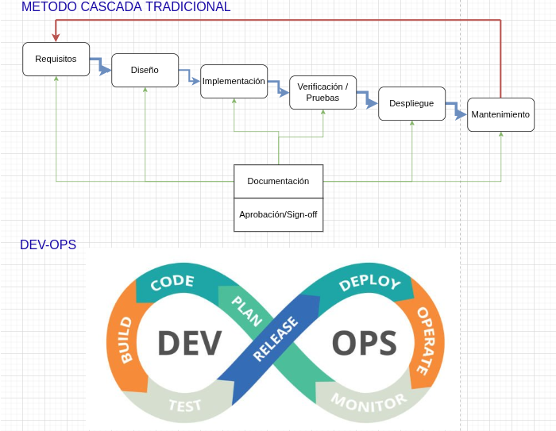

## Actividad 1: Introducción devops y devsecops 

### DevOps vs. cascada tradicional (investigación + comparación)

   En el método cascada todo es en fases largas y secuenciales, no hay mucho feedback hasta el final, así que si sale un error tarde, arreglarlo es mas costoso. En cambio DevOps es un ciclo constante de planeo, codifico, integro,pruebo, despliego y monitoreo, y asi otra vez; ademas gracias a la automatización (CI/CD, pruebas automáticas, infraestructura como código) y a que se trabaja en pequeños ciclos, los equipos reciben feedback casi inmediato.

   

   Hay contextos de desarrollo donde el metodo cascada todavía tiene sentido. Ejemplo: un software que corre en aviones comerciales o en equipos médicos. En estos contextos se exige una certificación regulatoria obligatoria y tambien hay una gran dependencia del hardware, lo que significa que cualquier cambio en el software obliga a repetir pruebas completas en el sistema total. El trade-off seria: se gana en conformidad y seguridad, porque todo queda bien documentado y probado, pero se pierde en velocidad y flexibilidad, ya que los ciclos de entrega son largos y los cambios toman mas tiempo.

### Ciclo tradicional de dos pasos y silos (limitaciones y anti-patrones)

   En el modelo tradicional de “construcción -> operación”, los equipos trabajan en silos y se pasan el software de un lado a otro con poca comunicación, esto trae limitaciones. Los cambios se entregan en grandes lotes porque no existe integración continua, tambien el proceso de corregir bugs es mas largo lo cual significa integraciones tardias.

   Los anti-patrones empeoran la situación de desarrollo. El “throw over the wall” consiste cuando desarrollador simplemente lanza el software a operaciones y se desentiende, esto provoca que en caso de incidente operaciones no tenga mucho contexto y el timepo de conocer y entender el software sea mayor. Tratar la seguridad como auditoría tardía, significa revisarla recién al final, esto significa descubrir fallas de seguridad tarde, lo que lleva a retrabajar el proceso.

   

### Principios y beneficios de DevOps (CI/CD, automatización, colaboración; Agile como precursor)

   En integración continua (CI) lo que se busca es que los cambios sean chicos y se integren rápido, así se detectan errores pronto, ademas las pruebas se ponen lo más cerca posible del código para que cada push se verifique solo. Con la entrega/despliegue continuo (CD), la idea es que todo eso fluya hacia producción sin trabas, con colaboración entre devs y ops para decidir si algo pasa al siguiente paso o no.

   Una práctica ágil, por ejemplo las reuniones diarias, sirven para decidir rápido qué cambios son mas importante y cuales no deberian avanzar, tambien se puede acordar que cierto tipo de pruebas se activen antes de pasar al ambiente de pruebas asi estas sirven como ideas para pipeline en el desarrollo.

   Un buen indicador para ver si dev y ops se entienden mejor puede ser el tiempo que pasa desde que un pull request queda listo hasta que el cambio está desplegado en el ambiente de pruebas. Si el tiempo es corto significa que hay mas comunicacion y comprension en el equipo de trabajo.

### Evolución a DevSecOps (seguridad desde el inicio: SAST/DAST; cambio cultural)

   En DevSecOps la seguridad se mete desde el inicio y no solo al final. Hay dos prácticas importantes: SAST y DAST. El SAST es estático, significa revisar el codigo fuente sin necesidad de correr la aplicación, y se ejecuta temprano en el pipeline casi al mismo tiempo que se hacen los builds y las pruebas unitarias. El DAST es dinámico porque prueba la aplicación ya corriendo, como si fueras un atacante externo, y se coloca mas adelante en el flujo, normalmente en el ambiente de stage.

   Se definen gates mínimos de seguridad que marque hasta donde se permite avanzar. Por ejemplo, si aparece un hallazgo crítico en un componente expuesto como el login o una API, el pipeline se bloquea, tambien se pide haya un porcentaje minimo de rutas críticas que tengan pruebas de seguridad activas, si ese porcentaje es menor, no se promueve nada hacia producción. Hay casos donde no se pueda corregir algo al instante, asi que hay políticas de excepción, para esto cada excepción tiene que tener un responsable claro, un plazo de caducidad y un plan de acción para corregir o al menos reducir el riesgo.