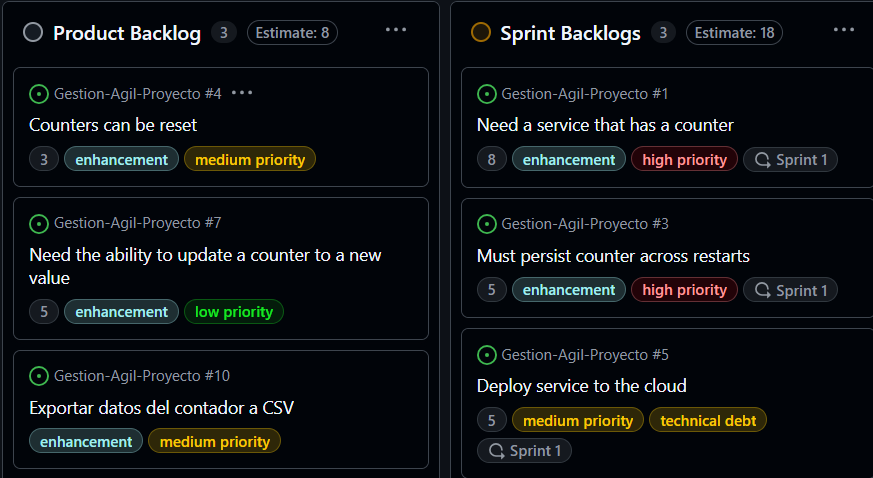
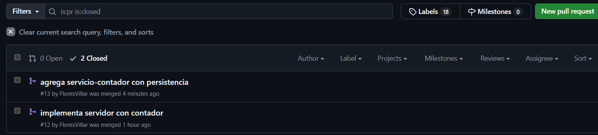
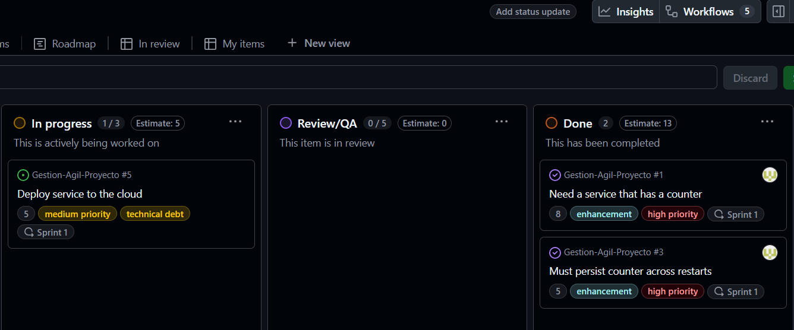
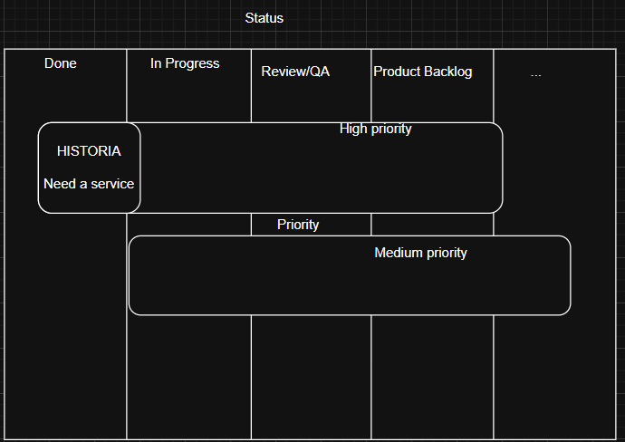
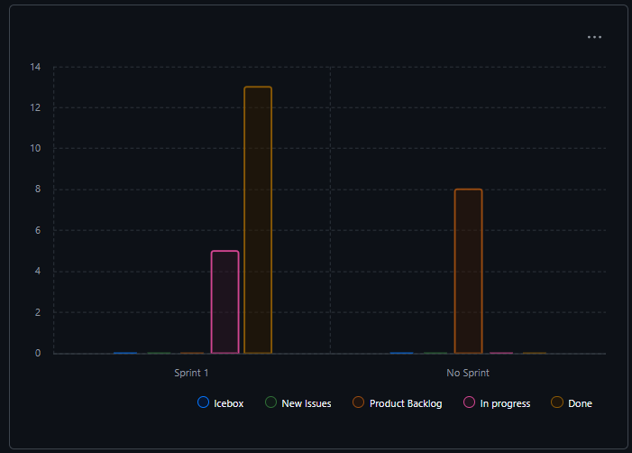
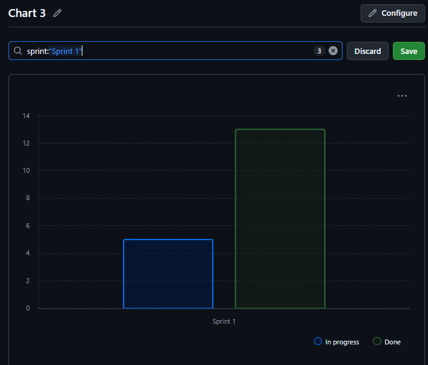
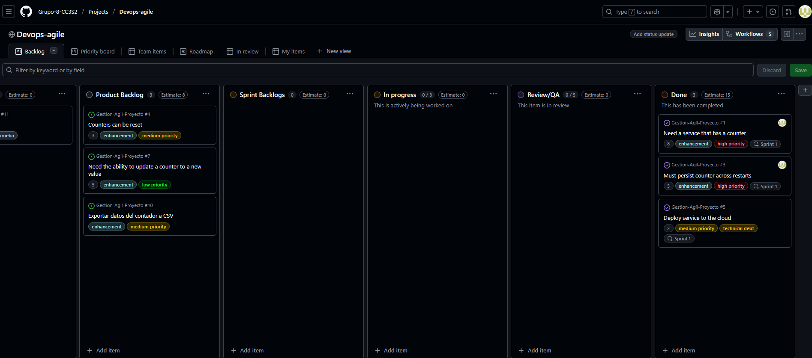
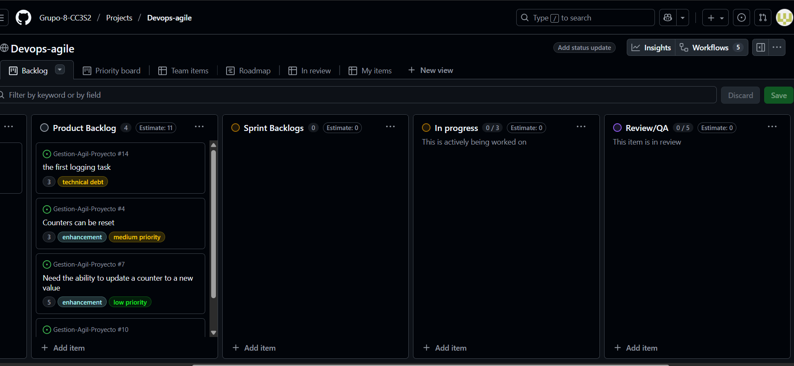

### **Actividad**: Gestión ágil de sprints con GitHub, planificación, ejecución y cierre de Sprints

La actividad 11 se completó , de forma resumida se crearon nuevos issues y se agregaron a las columnas de  kanban board, junto con algunas etiquetas, los issues se editan con la plantilla propuesta la cual sigue BDD.

## Parte 1 
```bash
1  Backlog → Fields → New Field  
    nombre :Sprint
    tipo de campo : iteracion
    duracion : dos semanas
2 En el kanban board las historias de Product Backlog →→→ Sprint Backlogs
                    ← estimacion (establacer tiempo) 
    las historias 
                    ← choose an interation (se asigna al sprint)

```


## Parte 2
Nos asignamos las 3 historias de sprint backlog , creamos las ramas en nuestro repo local , mientras que en kanban se ubican en la columna in progress, una vez completados las historias , se envian los push hacia el repo remoto y se solicita los pull request, entonces en kanban las historias se ubican en review/QA , una vez hecho los merges correspondientes los ubicamos en Done.<br>



<br>



## Parte 3
Esta tarea es un tanto confusa , el hecho de que las columnas de nuestro kanban sean valores del campo status, pero que ademas cada historia tenga otros campos con valores distintos. Y tambien el hecho que esos campos podrian ser columnas del kanban perfectamente, causa un poco de confusion. Sin embargo pensemos que los historias como los elementos de las intersecciones de los subconjuntos campos

Entonces aclarado eso,se crea un nuevo burndown chart para rastrear el campo sprint, es decir las historias que tienen un campo Sprint 1

y realizando el filtro <br>



Cambio los puntos de Deploy service to the cloud y moviendolo a Done


## Parte 4
Se crea un nuevo issue que guarda el log del servicio, se le asigna el campo status Product Backlog y 3 puntos
<br>
