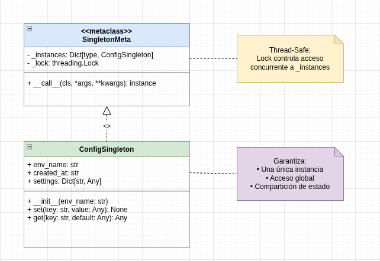
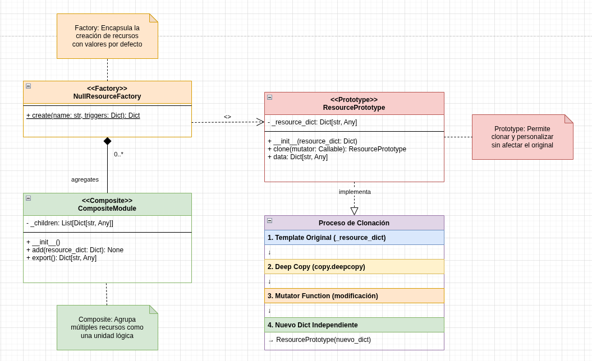
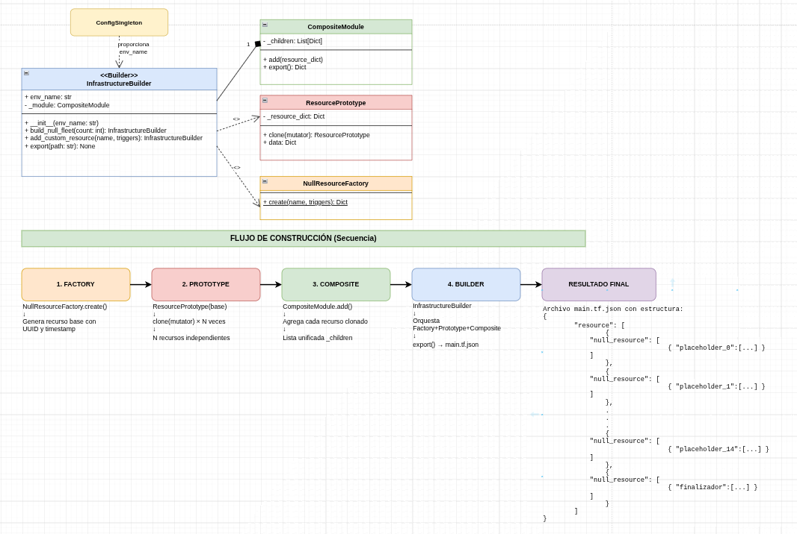

# Fase 1: Exploración y análisis

###  **Singleton**: Cómo `SingletonMeta` garantiza una sola instancia (usando el diccionario `_instances` y el método `__call__`) y el rol del `lock` (para sincronización en entornos multihilo, evitando carreras).

SingletonMeta se asegura de que solo exista una única instancia de una clase usando el diccionario _instances, donde guarda la primera vez que se crea el objeto. Cada vez que intento crear otra instancia, el método __call__ revisa si la clase ya está en ese diccionario y, si es así, simplemente devuelve la misma instancia en lugar de crear una nueva. El lock sirve para evitar problemas cuando varios hilos intentan crear la instancia al mismo tiempo, bloquea el acceso mientras se crea la primera instancia, asegurando que solo un hilo pueda hacerlo y los demás esperen, evitando así que se creen múltiples objetos por error. Singleton garantiza una única instancia global dentro del proceso del programa en ejecución (en el espacio de memoria del proceso Python actual).

###  **Factory**: Cómo `NullResourceFactory` encapsula la creación de `null_resource` (método estático `create` que genera un diccionario Terraform-compatible), y el propósito de `triggers` (para forzar re-ejecuciones en Terraform, usando UUID y timestamp para unicidad).

NullResourceFactory se encarga de centralizar toda la lógica para crear recursos null_resource de Terraform, usando el método estático create, que devuelve un diccionario con la estructura exacta que Terraform espera en formato JSON, así no tengo que escribir esa estructura a mano cada vez. Los triggers sirven para que Terraform sepa cuándo debe volver a ejecutar el recurso, se agrega un UUID y un timestamp para asegurar que cada ejecución sea única, lo que permite forzar recreaciones o actualizaciones
cuando sea necesario.

###  **Prototype**: Explicación del proceso de clonación profunda (usando `deepcopy` para copiar el template independientemente), y cómo el `mutator` (una función callable) permite personalizar cada clon sin afectar el original.

En este patrón, se usa copy.deepcopy para hacer una copia completa del recurso original, de modo que el clon sea totalmente independiente y cualquier cambio que haga en él no afecte al original. Luego, el parámetro mutator deja pasar una función que puede modificar el clon justo después de crearlo, por ejemplo, cambiar un nombre o un valor, así puedo generar múltiples versiones personalizadas de un mismo recurso base sin riesgo de alterar el modelo original.

###  **Composite**: Cómo `CompositeModule` agrupa múltiples bloques (método `add` para agregar hijos, `export` para merging recursivo en un JSON válido para Terraform, uniendo recursos como `null_resource`).

CompositeModule permite juntar varios recursos Terraform en una sola estructura, como si fueran parte de un mismo módulo. Con el método add vamos agregando los distintos bloques (por ejemplo, varios null_resource), y luego con export los combino todos dentro de un solo diccionario bajo la clave "resource", de esta forma se puede manejar y exportar un conjunto completo de recursos como una unidad lógica lista para usar en un archivo JSON de Terraform.

###  **Builder**: Cómo `InfrastructureBuilder` orquesta los patrones (usa Factory para base, Prototype para clones mutados, Composite para agrupar, y exporta a JSON via `export`).

InfrastructureBuilder actúa como un director que combina varios patrones para construir infraestructura Terraform de forma ordenada. Primero usa el patrón Factory para crear un recurso base (null_resource), luego aplica el patrón Prototype para clonar y personalizar cada recurso sin afectar el original, y finalmente usa el patrón Composite para agrupar todos esos recursos en un solo módulo lógico. Al final, con el método export, genera un archivo JSON listo para Terraform, facilitando todo el proceso de creación y despliegue de forma fluida y reutilizable.

### Fragmentos del `main.tf.json` generado por `generate_infra.py`

```json
{
    "resource": [
        {
            "null_resource": [
                {
                    "placeholder_0": [
                        {
                            "triggers": {
                                "factory_uuid": "7c8779cf-335a-41ba-a997-43d49948a44f",
                                "timestamp": "2025-11-07T16:00:49.090216",
                                "index": 0
                            }
                        }
                    ]
                }
            ]
        },
        {
            "null_resource": [
                {
                    "placeholder_1": [
                        {
                            "triggers": {
                                "factory_uuid": "7c8779cf-335a-41ba-a997-43d49948a44f",
                                "timestamp": "2025-11-07T16:00:49.090216",
                                "index": 1
                            }
                        }
                    ]
                }
            ]
        },
```

```json
        {
            "null_resource": [
                {
                    "placeholder_14": [
                        {
                            "triggers": {
                                "factory_uuid": "7c8779cf-335a-41ba-a997-43d49948a44f",
                                "timestamp": "2025-11-07T16:00:49.090216",
                                "index": 14
                            }
                        }
                    ]
                }
            ]
        },
        {
            "null_resource": [
                {
                    "finalizador": [
                        {
                            "triggers": {
                                "nota": "Recurso compuesto generado din\u00e1micamente en tiempo de ejecuci\u00f3n",
                                "factory_uuid": "7e365219-a06c-4573-b980-921ef450c90d",
                                "timestamp": "2025-11-07T16:00:49.090860"
                            }
                        }
                    ]
                }
            ]
        }
    ]
}
```

### Diagramas

#### Diagrama 1: Patrón Singleton



#### Diagrama 2: Factory, Prototype y Composite



#### Diagrama 3: Flujo Completo con Builder

