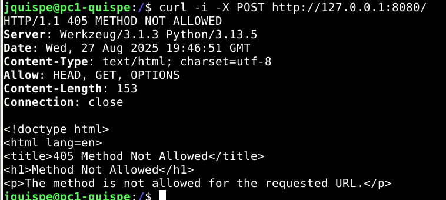
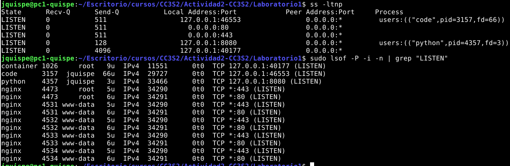

### Actividad 2:  HTTP, DNS, TLS y 12-Factor (port binding, configuración, logs)

**Objetivo:** practicar despliegues **seguros y reproducibles** combinando aplicación (HTTP), resolución de nombres (DNS), cifrado en tránsito (TLS) y buenas prácticas**12-Factor** (variables de entorno, port binding y logs a stdout).

#### Archivos base (proyecto elemental)

* **Aplicación** Flask con `PORT`, `MESSAGE`, `RELEASE` por variables de entorno, expone `/` y registra logs en **stdout**.
* **Guía/Make (paso a paso Linux y WSL)** con objetivos `make` para hosts, TLS, Nginx, chequeos y demo DNS.
* **Nginx**: terminación TLS en `:443` y proxy a `127.0.0.1:8080` (redirección HTTP->HTTPS opcional).

#### Entregables (en tu repositorio personal)

Sube una carpeta **`Actividad2-CC3S2/`** con:

- `REPORT.md` (evidencias y respuestas), 2) capturas de terminal (o *logs* en texto), 3) cualquier ajuste propuesto al código/configuración, 4) un **Makefile** y/o scripts que permitan repetir tu flujo localmente (si usas WSL, documenta diferencias). Referencia comandos exactos usados.


### Actividades y evidencias

#### 1) HTTP: Fundamentos y herramientas

**Meta:** ver anatomía petición/respuesta, métodos y códigos.

1. **Levanta la app** con variables de entorno (12-Factor):
   `PORT=8080 MESSAGE="Hola CC3S2" RELEASE="v1" python3 app.py` (usa tu *venv*). La app **escucha** en el puerto indicado y **loggea en stdout**. Incluye extracto de salida (stdout) en el reporte.

   

3. **Inspección con `curl`:**

   * `curl -v http://127.0.0.1:8080/` (cabeceras, código de estado, cuerpo JSON).

   
   
   * `curl -i -X POST http://127.0.0.1:8080/` (explica qué ocurre si no hay ruta/método).

   

   No hay ruta o método definido, entonces responde 405

   * **Pregunta guía:** ¿Qué campos de respuesta cambian si actualizas `MESSAGE`/`RELEASE` sin reiniciar el proceso? Explica por qué.

   Las variables de entorno se leen al momento de iniciar el proceso, Si no reiniciamos, la app sigue usando los valores que leyó al arrancar, el JSON de respuesta no cambia.

4. **Puertos abiertos con `ss`:**

   * `ss -ltnp | grep :8080` (evidencia del proceso y socket).

   

   La aplicacion python3 esta corriendo en el puerto 8080, el puerto es modo LISTEN(esperando conexiones), pero solo accesible desde la misma máquina.

5. **Logs como flujo:** Demuestra que los logs salen por stdout (pega 2–3 líneas). Explica por qué **no** se escriben en archivo (12-Factor). Herramientas: `curl`, `ss`, `lsof` (opcional para PID/FD), `journalctl` (si corres como servicio).

   

   No hay archivo porque la app sigue la práctica 12-Factor: los logs van a stdout/stderr, y el entorno decide si los redirige a fichero, syslog, journald u otro.


#### 2) DNS: nombres, registros y caché

**Meta:** resolver `miapp.local` y observar TTL/caché.

1. **Hosts local:** agrega `127.0.0.1 miapp.local` (Linux y/o Windows según tu entorno). Usa el *target* de la guía si está disponible (`make hosts-setup`).

   

2. **Comprueba resolución:**

   * `dig +short miapp.local` (debe devolver `127.0.0.1`).
   * `getent hosts miapp.local` (muestra la base de resolución del sistema).

   

   - Prueba con dig: error (porque no hay zona DNS que conozca miapp.local). 
   - Prueba con getent: éxito (127.0.0.1 miapp.local) gracias a que consulta directamente al archivo etc/hosts

3. **TTL/caché (conceptual):** con `dig example.com A +ttlunits` explica cómo el TTL afecta respuestas repetidas (no cambies DNS público, solo observa).

   

   Preguntamos al DNS configurado en el sistema la dirección IPv4 de example.com y muestra cuánto tiempo se puede cachear cada respuesta. En mi salida, los registros A de example.com tienen un TTL de 5m. Esto significa que durante ese tiempo las respuestas se sirven desde caché y el TTL va disminuyendo en consultas repetidas. Una vez que expira, el resolver vuelve a consultar al servidor DNS para obtener datos frescos.

   

4. **Pregunta guía:** ¿Qué diferencia hay entre **/etc/hosts** y una zona DNS autoritativa? ¿Por qué el *hosts* sirve para laboratorio? Explica en 3–4 líneas. Herramientas: `dig`, `getent`, `resolv.conf`/`resolvectl` (si aplica).

- /etc/hosts es un archivo local, las entradas están solo en mi máquina, tienen prioridad inmediata y no es escalable.
- Una DNS autoritativa es distribuida: un servidor administra nombres de un dominio y responde consultas de todo Internet, con TTL y caché.
- El hosts es útil en laboratorio porque permite simular un nombre de dominio sin montar infraestructura DNS real.

#### 3) TLS: seguridad en tránsito con Nginx como *reverse proxy*

**Meta:** terminar TLS en Nginx `:443` y *proxyear* a Flask en `127.0.0.1:8080`.

1. **Certificado de laboratorio:** genera autofirmado (usa el *target* `make tls-cert` si existe) y coloca crt/key donde lo espera Nginx (ver guía).

   

2. **Configura Nginx:** usa el ejemplo provisto para **terminación TLS** y **proxy\_pass** a `http://127.0.0.1:8080;` con cabeceras `X-Forwarded-*`. Luego `nginx -t` y **reinicia** el servicio.
   Incluye el *snippet* clave de tu `server` en el reporte.

   

3. **Valida el *handshake*:**

   * `openssl s_client -connect miapp.local:443 -servername miapp.local -brief` (muestra TLSv1.2/1.3, cadena, SNI).

      Validacion de handshake:

      

   * `curl -k https://miapp.local/` (explica el uso de `-k` con certificados autofirmados).

      La opción -k se usa porque el certificado es autofirmado, no está en la lista de autoridades de confianza del sistema, así que curl lo rechazaría si no usamos -k

      

5. **Puertos y logs:**

   * `ss -ltnp | grep -E ':(443|8080)'` (evidencia de ambos sockets).

      

   * `journalctl -u nginx -n 50 --no-pager` **o** `tail -n 50 /var/log/nginx/error.log` (pega 3–5 líneas relevantes).

      - sudo journalctl -u nginx -n 50 --no-pager

      

      - cat /var/log/nginx/access.log

      

> Nota: el *vínculo*  Nginx->Flask es **HTTP interno** en `127.0.0.1:8080`, tu cliente entra por **HTTPS** en `:443`.

#### 4) 12-Factor App: port binding, configuración y logs

**Meta:** demostrar tres principios clave en tu app.

1. **Port binding:** muestra que la app **escucha** en el puerto indicado por `PORT` (evidencia `ss`).

   

2. **Config por entorno:** ejecuta dos veces con distintos `MESSAGE`/`RELEASE` y documenta el efecto en la respuesta JSON.

   ```Makefile
   # Variables (12-Factor)
   APP_NAME ?= miapp
   DOMAIN   ?= miapp.local
   PORT     ?= 8080
   MESSAGE  ?= Hola CC3S2
   RELEASE  ?= v1
   ```

   ```Python
   # 12-Factor: configuración vía variables de entorno (sin valores codificados)
   PORT = int(os.environ.get("PORT", "8080"))
   MESSAGE = os.environ.get("MESSAGE", "Hola CC3S2")
   RELEASE = os.environ.get("RELEASE", "v1")
   ```

   

   ```Makefile
   # Variables (12-Factor)
   APP_NAME ?= miapp
   DOMAIN   ?= miapp.local
   PORT     ?= 8080
   MESSAGE  ?= hola CC3S2 2025-2
   RELEASE  ?= v2
   ```

   ```Python
   # 12-Factor: configuración vía variables de entorno (sin valores codificados)
   PORT = int(os.environ.get("PORT", "8080"))
   MESSAGE = os.environ.get("MESSAGE", "Hola CC3S2 2025-2")
   RELEASE = os.environ.get("RELEASE", "v2")
   ```

   


3. **Logs a stdout:** redirige a archivo mediante *pipeline* de shell y adjunta 5 líneas representativas. Explica por qué **no** se configura *log file* en la app.

   

   

#### 5) Operación reproducible (Make/WSL/Linux)

**Meta:** empaquetar tu flujo en `make` o scripts para repetirlo en otra máquina.

* Sigue la guía paso a paso (Linux/WSL) y **documenta divergencias** (p.ej. `systemctl` vs `service` en WSL, *hosts* de Windows vs WSL).
  Incluye una tabla "Comando -> Resultado esperado".
* Si tienes *targets* como `make prepare`, `make run`, `make nginx`, `make check-http`, `make check-tls`, `make dns-demo`, úsalos y pega su salida resumida.

   Flask:

   

   Flask - Nginx:

   

   Pruebas:

   

#### Mejora incremental 

* **Logs estructurados** (JSON por línea) en stdout. Muestra un ejemplo y por qué facilita *parsing*.
* **Script `make`** que haga *end-to-end*: preparar venv -> levantar app -> cert TLS -> Nginx -> chequeos `curl/dig/ss`.;
* **`systemd`** (si aplica): define unidad para la app y valida con `systemctl status` y `journalctl -u`. (Adjunta *snippet* clave y evidencia).

#### Preguntas guía (responde en `Reporte.md`)

1. **HTTP:** explica **idempotencia** de métodos y su impacto en *retries*/*health checks*. Da un ejemplo con `curl -X PUT` vs `POST`.
2. **DNS:** ¿por qué `hosts` es útil para laboratorio pero no para producción? ¿Cómo influye el **TTL** en latencia y uso de caché?;
3. **TLS:** ¿qué rol cumple **SNI** en el *handshake* y cómo lo demostraste con `openssl s_client`?
4. **12-Factor:** ¿por qué **logs a stdout** y **config por entorno** simplifican contenedores y CI/CD?;
5. **Operación:** ¿qué muestra `ss -ltnp` que no ves con `curl`? ¿Cómo triangulas problemas con `journalctl`/logs de Nginx?;


#### Comando a utilizar (usa varias en tu evidencia)

* **HTTP:** `curl -v/-i/-X`, `httpie` (opcional).
* **Puertos/Red:** `ss -ltnp`, `lsof -i`, `ip a`, `ip route`.
* **DNS:** `dig +short`, `dig @1.1.1.1 example.com`, `getent hosts`.
* **TLS:** `openssl s_client -connect host:443 -servername host -brief`.
* **Logs/Servicios:** `journalctl -u nginx`, `tail -f /var/log/nginx/error.log`, `systemctl status` / `service status`.;

#### Resultado esperado

* Acceso **HTTP** en `127.0.0.1:8080` (port binding por entorno). Respuesta JSON con `message` y `release`. **Logs** en stdout.;
* Resolución de `miapp.local` vía *hosts* para pruebas.;
* Acceso **HTTPS** en `miapp.local:443` con Nginx como *reverse proxy* a `127.0.0.1:8080`. *Handshake* válido y evidencia de cabeceras `X-Forwarded-*`.;