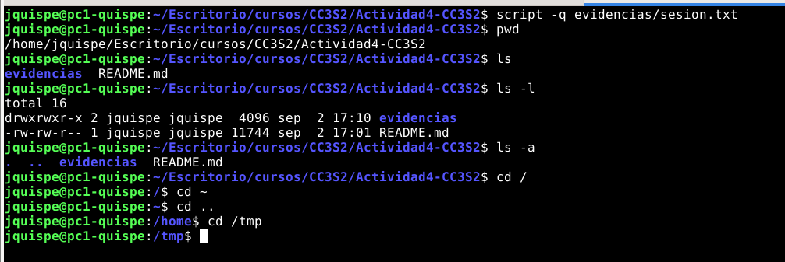
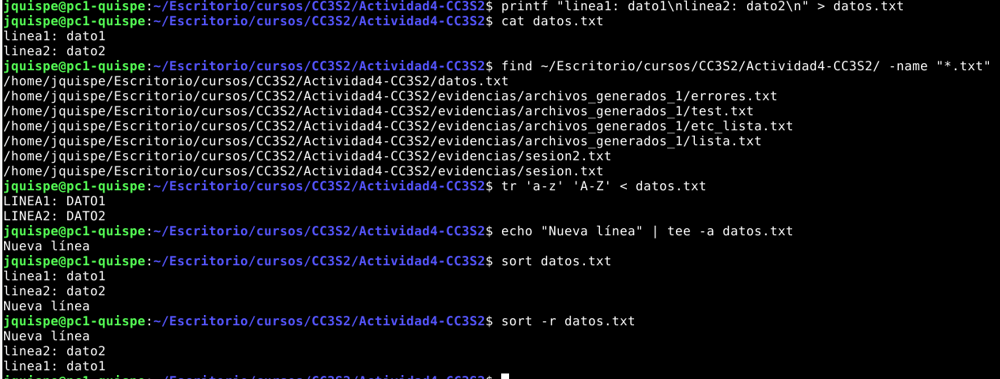
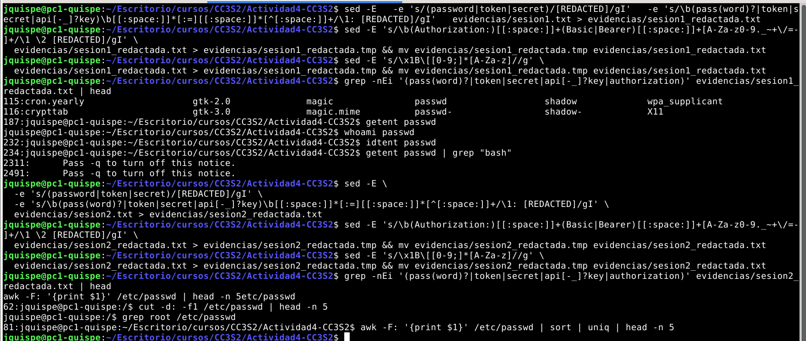

## Actividad 4: Introducción a herramientas CLI en entornos Unix-like para DevSecOps

Este laboratorio diseñado en el manejo de la línea de comandos (CLI) en sistemas Unix-like, con un enfoque orientado a DevSecOps. 
DevSecOps integra la seguridad en el ciclo de vida del desarrollo de software, y el dominio de la CLI es fundamental para automatizar tareas, gestionar entornos, auditar sistemas y procesar datos de manera segura y eficiente.

Este laboratorio se divide en tres secciones principales, cada una con un marco teórico seguido de explicaciones paso a paso y ejercicios de reforzamiento. 

### Sección 1: Manejo sólido de CLI

#### Riesgo & mitigación en DevSecOps

Riesgo: Errores en navegación o manipulación masiva pueden llevar a pérdida de datos o exposición (ejemplo. borrado accidental en pipelines CI/CD). 
Mitigación: Usa opciones seguras como `--` para fin de argumentos, `-print0/-0` para manejar espacios en nombres, y "dry-run" (anteponiendo `echo`) para pruebas. 
Evita operaciones recursivas en `/`.

#### Marco teórico
La CLI (Command Line Interface) es la interfaz de texto para interactuar con el sistema operativo. En DevSecOps, es esencial para scripting, automatización de pipelines CI/CD (como en Jenkins o GitHub Actions), y tareas de seguridad como escaneo de vulnerabilidades. 
Conceptos clave:

- **Navegación**: Moverse por el sistema de archivos (directorios y archivos).
- **Globbing**: Usar patrones (wildcards) para seleccionar múltiples archivos, útil para procesar logs en batch.
- **Tuberías (pipes)**: Enlazar comandos para procesar datos en cadena, optimizando flujos de trabajo.
- **Redirecciones**: Enviar salida de comandos a archivos o entradas, para logging y auditoría segura.
- **xargs**: Convertir salida de un comando en argumentos para otro, ideal para operaciones en masa como eliminación segura de archivos.

Estos elementos permiten operaciones eficientes y seguras, reduciendo errores humanos en entornos de producción.

#### Explicaciones paso a paso
1. **Navegación básica**:
   - `pwd`: Muestra el directorio actual (Print Working Directory).
     - Ejecuta: `pwd` -> Debería mostrar algo como `/home/tuusuario`.
   - `ls`: Lista archivos y directorios.
     - `ls -l`: Lista en formato largo (permisos, dueño, tamaño).
     - `ls -a`: Incluye archivos ocultos (empiezan con `.`).
   - `cd`: Cambia de directorio.
     - `cd /`: Va al raíz.
     - `cd ~`: Va al home del usuario.
     - `cd ..`: Sube un nivel.
     - Ejecuta: `cd /tmp` -> Navega a un directorio temporal.
    
    

2. **Globbing**:
   - Usa `*` (cualquier cadena), `?` (un carácter), `[ ]` (rango).
     - `ls *.txt`: Lista todos los archivos terminados en .txt.
     - Crea archivos de prueba: `touch archivo1.txt archivo2.txt archivo3.doc`.
     - Ejecuta: `ls archivo*.txt` -> Muestra archivo1.txt y archivo2.txt.

    

3. **Tuberías (Pipes)**:
   - Usa `|` para enviar salida de un comando como entrada a otro.
     - `ls | wc -l`: Cuenta el número de archivos en el directorio actual (nota: no cuenta ocultos; usa `ls -A | wc -l` para incluirlos).

    

4. **Redirecciones**:
   - `>`: Redirige salida a un archivo (sobrescribe).
     - `ls > lista.txt`: Guarda la lista en un archivo.
   - `>>`: Agrega al final sin sobrescribir.
     - `printf "Hola\n" >> lista.txt`.
   - `<`: Redirige entrada desde un archivo.
     - `wc -l < lista.txt`: Cuenta líneas de lista.txt.
   - `2>`: Redirige errores.
     - `ls noexiste 2> errores.txt`.
  
    

5. **xargs**:
   - Procesa salida como argumentos.
     - Más seguro para borrados (evita problemas con espacios): `find . -maxdepth 1 -name 'archivo*.txt' -print0 | xargs -0 rm --` o interactivo: `find . -name 'archivo*.txt' -exec rm -i {} +`.
     - Ejemplo: `echo "archivo1.txt archivo2.txt" | xargs rm` (¡cuidado, usa con precaución! Para dry-run: antepone `echo`).

    

#### Ejercicios de reforzamiento
1. Navega a `/etc`, lista archivos ocultos y redirige la salida a un archivo en tu home: `cd /etc; ls -a > ~/etc_lista.txt`.
2. Usa globbing para listar todos los archivos en `/tmp` que terminen en `.txt` o `.doc`, y cuenta cuántos hay con una tubería (versión robusta): `find /tmp -maxdepth 1 -type f \( -name '*.txt' -o -name '*.doc' \) | wc -l`.
3. Crea un archivo con `printf "Línea1\nLínea2\n" > test.txt`.
4. (Intermedio) Redirige errores de un comando fallido (ej. `ls noexiste`) a un archivo y agrégalo a otro: `ls noexiste 2>> errores.log`. Para borrados con xargs, primero haz un dry-run: `find . -maxdepth 1 -name 'archivo*.txt' | xargs echo rm`.

#### Comprobación

- `nl test.txt` (muestra líneas numeradas).
- `wc -l lista.txt` (cuenta líneas en lista.txt).

### Sección 2: Administración básica

#### Riesgo & Mitigación en DevSecOps
Riesgo: Over-permission en usuarios/permisos puede exponer datos sensibles en contenedores o repos. 
Mitigación: Aplica `umask 027` para archivos nuevos (solo durante la sesión), evita operaciones recursivas en `/` y usa `--preserve-root` con `chown/chgrp/rm`. 
Para procesos, usa señales controladas para no interrumpir servicios críticos.

#### Marco teórico
La administración básica en Unix-like es crucial en DevSecOps para gestionar accesos seguros, monitorear procesos y servicios, y asegurar la integridad del sistema. 
- **Usuarios/Grupos/Permisos**: Controlan quién accede a qué, previniendo brechas de seguridad (principio de menor privilegio).
- **Procesos/Señales**: Monitorean y controlan ejecuciones, útil para depurar contenedores Docker o pods Kubernetes.
- **systemd**: Gestor de servicios en sistemas modernos como Ubuntu, para iniciar/parar servicios de manera segura.
- **journalctl**: Herramienta de logging para auditar eventos del sistema, esencial en investigaciones de incidentes de seguridad.

Estos permiten configuraciones seguras en pipelines DevSecOps, como rotación de credenciales o monitoreo de anomalías.

#### Explicaciones paso a paso
1. **Usuarios/Grupos/Permisos**:
  - `whoami`: Muestra tu usuario actual.
  - `id`: Muestra UID, GID y grupos.
  - Crear usuario (con sudo): `sudo adduser nuevouser` (en entornos compartidos/multi-usuario, hazlo solo en WSL o VM personal.
    Alternativa mock: crea un directorio `mkdir mockuser` y simula `chown` con tu usuario actual para no alterar cuentas reales).
  - Grupos: `sudo addgroup nuevogrupo; sudo usermod -aG nuevogrupo nuevouser`.
  - Permisos: `chmod` cambia permisos (r=4, w=2, x=1; ej. 755 = rwxr-xr-x).
    - `touch archivo; chmod 644 archivo`: Lectura/escritura para dueño, lectura para otros.
  - Dueño: `chown nuevouser:nuevogrupo archivo`.
  - Nota para macOS: `/etc/passwd` puede variar; usa ejemplos adaptados.

    

2. **Procesos/Señales**:
  - `ps aux`: Lista todos los procesos.
  - `top`: Monitor interactivo (presiona q para salir).
  - Señales: `kill -SIGTERM PID` (termina proceso; encuentra PID con `ps`).
    - `kill -9 PID`: Fuerza terminación (SIGKILL).

3. **systemd**:
  - `systemctl status`: Muestra estado de un servicio (ej. `systemctl status ssh`).
  - Iniciar/parar: `sudo systemctl start/stop servicio`.
  - Habilitar al boot: `sudo systemctl enable servicio`.
  - Nota para macOS: No hay systemd; usa análogos como `launchctl` o `brew services` (si tienes Homebrew instalado).

    

4. **journalctl**:
  - `journalctl -u servicio`: Logs de un servicio.
  - `journalctl -f`: Sigue logs en tiempo real.
  - `journalctl --since "2025-08-29"`: Logs desde una fecha.
  - Compatibilidad: En WSL2 sin systemd (verifica con `systemctl`), fallback: `sudo tail -n 100 /var/log/syslog` o como última opción `sudo dmesg --ctime | tail -n 50`.
    En macOS: `log show --last 1h | grep -i error` o `tail -f /var/log/system.log`.

    

#### Ejercicios de reforzamiento
1. Crea un usuario "devsec" y agrégalo a un grupo "ops". Cambia permisos de un archivo para que solo "devsec" lo lea: `sudo adduser devsec; sudo addgroup ops; sudo usermod -aG ops devsec; touch secreto.txt; sudo chown devsec:ops secreto.txt; sudo chmod 640 secreto.txt` (usa mock si es entorno compartido).
2. Lista procesos, encuentra el PID de tu shell (`ps aux | grep bash`), y envía una señal SIGTERM (no lo mates si es crítico).
3. Verifica el estado de un servicio como "systemd-logind" con `systemctl status systemd-logind`, y ve sus logs con `journalctl -u systemd-logind -n 10`.
4. (Intermedio) Inicia un proceso en background (`sleep 100 &`), lista con `ps`, y mátalo con `kill`.

### Sección 3: Utilidades de texto de Unix
#### Riesgo & Mitigación en DevSecOps
Riesgo: Procesamiento de logs puede exponer datos sensibles o causar borrados masivos. 
Mitigación: Usa filtros como `journalctl -p err..alert` para severidades, rotación de logs, y opciones seguras en find/xargs (-i para interactivo, -- para seguridad).

#### Marco teórico
El "Utilidades de texto Unix" es un conjunto de herramientas para procesar texto, vital en DevSecOps para analizar logs, parsear outputs de herramientas de seguridad (como Nmap o OWASP ZAP), y automatizar informes. 
- **grep**: Busca patrones en texto.
- **sed**: Edita streams de texto (sustituir, eliminar).
- **awk**: Procesa datos estructurados (columnas).
- **cut**: Extrae campos.
- **sort/uniq**: Ordena y elimina duplicados.
- **tr**: Traduce caracteres.
- **tee**: Divide salida a múltiples destinos.
- **find**: Busca archivos por criterios.

Estas herramientas permiten pipelines eficientes para tareas como filtrado de vulnerabilidades en scans.

#### Explicaciones paso a paso
1. **grep**: `grep patrón archivo` (ej. `grep error /var/log/syslog`).
   - Opciones: `-i` (insensible mayúsculas), `-r` (recursivo).

2. **sed**: `sed 's/viejo/nuevo/' archivo` (sustituye).
   - `sed '/patrón/d' archivo`: Elimina líneas.

3. **awk**: `awk '{print $1}' archivo` (imprime primera columna).
   - Separador: `awk -F: '{print $1}' /etc/passwd`.

4. **cut**: `cut -d: -f1 /etc/passwd` (primera columna separada por :).

5. **sort/uniq**: `sort archivo | uniq` (ordena y quita duplicados).

6. **tr**: `tr 'a-z' 'A-Z' < archivo` (convierte a mayúsculas).

7. **tee**: `comando | tee archivo` (muestra y guarda).

8. **find**: `find /directorio -name "*.txt"` (busca archivos).

Crea un archivo de prueba: `printf "linea1: dato1\nlinea2: dato2\n" > datos.txt`.

Pruebas:

  

  

#### Ejercicios de reforzamiento
1. Usa grep para buscar "root" en `/etc/passwd`: `grep root /etc/passwd`.
2. Con sed, sustituye "dato1" por "secreto" en datos.txt: `sed 's/dato1/secreto/' datos.txt > nuevo.txt`.
3. Con awk y cut, extrae usuarios de `/etc/passwd`: `awk -F: '{print $1}' /etc/passwd | sort | uniq`.
4. Usa tr para convertir un texto a mayúsculas y tee para guardarlo: `printf "hola\n" | tr 'a-z' 'A-Z' | tee mayus.txt`.
5. (Intermedio) Encuentra archivos en `/tmp` modificados en los últimos 5 días: `find /tmp -mtime -5 -type f`.
6. Pipeline completo: `ls /etc | grep conf | sort | tee lista_conf.txt | wc -l`.
7. (Opcional) Usa tee para auditoría: `grep -Ei 'error|fail' evidencias/sesion.txt | tee evidencias/hallazgos.txt`.

  

#### Comprobación
- `file lista_conf.txt && head lista_conf.txt` (verifica tipo y contenido).
- `cat mayus.txt` (confirma transformación).

  

### Proceso de sanitización

Usamos sed como un sanitizador de logs, aplicando reglas de limpieza y el resultado es un log seguro para compartir.

