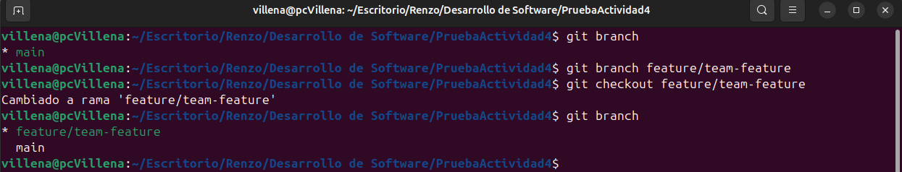
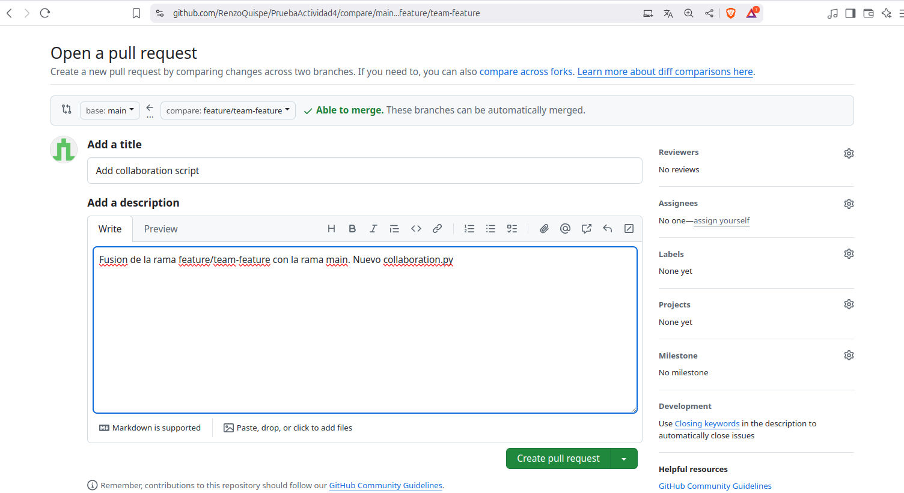

## **Actividad 6**: Introducción a Git conceptos básicos y operaciones esenciales

### Objetivo de aprendizaje

Familiarizarse con los conceptos básicos de Git y realizar operaciones esenciales, como la configuración inicial, creación de repositorios, preparación y confirmación de cambios, visualización de historial, y gestión de ramas.

#### Conceptos básicos de Git: Comienza con una experiencia práctica

Antes de profundizar en los detalles, comencemos con una experiencia práctica. Es probable que sea más fácil comprender el concepto probándolo en lugar de solo leerlo al principio.

#### git config: Preséntate a Git

Ahora, hay algo que debes hacer antes de comenzar un proyecto. Preséntate a Git. Para presentarte a Git, usa el comando `git config`:

```bash
$ git config --global user.name "Kapumota"
$ git config --global user.email "kapumota@example.com"
```

`git config` es un comando utilizado para configurar Git a nivel de sistema, usuario y repositorio. El nivel *system* se aplica a todos los usuarios y a todos los repositorios. El nivel *global* se aplica a todos los repositorios de un usuario específico. El nivel *local* se aplica solo a un repositorio.

Para verificar que tu presentación se ha registrado, puedes comprobarlo con el comando `git config --list`:

```bash
$ git config --list

user.name=Your Name
user.email=Your Email
```

#### git init: Donde comienza tu viaje de código

Al igual que cada gran viaje tiene su origen, en el mundo de Git, el viaje de tu código comienza con el comando `git init`. El comando se usa para inicializar un nuevo repositorio de Git y comenzar a rastrear directorios existentes. Cuando ejecutas el comando, configura un directorio `.git` lleno de todo lo necesario para el control de versiones. 

Con eso fuera del camino, estás listo para sumergirte en la gama de comandos de Git y comenzar a rastrear y actualizar tu proyecto:

```bash
// Crea un directorio
$ mkdir kapumota-repo

// Cambia el directorio de trabajo actual
$ cd kapumota-repo/

$ git init
```

Otra forma es pasar un nombre de directorio como argumento, como `git init kapumota-repo`; esto creará el directorio, por lo que no necesitas ejecutar el comando `mkdir`.

Ahora que se ha creado el directorio `.git/`, los cambios en los archivos se guardan en el directorio `.git/`, pero Git no guarda automáticamente los archivos. En Git, *guardar* se completa ejecutando el comando `git add`, que selecciona conscientemente los archivos para guardar entre los que se han editado, agregado o eliminado, y el comando `git commit`, que registra esos cambios.

A continuación, agreguemos algo de código al repositorio.

#### git add: Preparando tu código

El comando `git add` es tu puente entre hacer cambios en tu directorio de trabajo y prepararlos para ser almacenados permanentemente en tu repositorio de Git. 
Cuando haces cambios en tus archivos, Git reconoce que estos archivos han cambiado, pero estos cambios no están automáticamente listos para convertirse en parte del historial. Aquí es donde entra `git add`. 

Primero, crea un nuevo archivo en tu directorio `kapumota-repo`:

```bash
// Crear un archivo README.md
$ echo " README" > README.md
```

El comando `git status` muestra el estado actual de tu repositorio, mostrando qué archivos tienen cambios que están siendo rastreados y cuáles no. Cuando ves el mensaje "*Untracked files*", es la forma de Git de informarte que hay un archivo del que aún no se le ha dicho que esté pendiente. 

En nuestro ejemplo, el archivo `README.md` es nuevo para Git y no está registrado; por lo tanto, está etiquetado como no rastreado:

```bash
// Verificando cómo Git reconoce el nuevo archivo
$ git status

On branch main
No commits yet

Untracked files:
  (use "git add <file>..." to include in what will be committed)
    README.md
```

Los archivos recién agregados son parte de tu proyecto, pero no han sido rastreados por Git. Para moverlos del estado no rastreado a un estado rastreado, usa el comando `git add`:

```bash
$ git add README.md
$ git status

On branch main
No commits yet

Changes to be committed:
  (use "git rm --cached <file>..." to unstage)
    new file:   README.md
```

Ahora Git reconoce `README.md` como un nuevo archivo y ahora está rastreado. El estado objetivo para guardar mediante el comando `git add` se llama *staged* (preparado). También puedes escuchar el término *índice* (index) utilizado indistintamente con *staging*. Antes de que los archivos o cambios sean preparados, residen en un área a menudo referida como el *espacio de trabajo* (workspace). 

Esta es esencialmente el entorno donde estás haciendo cambios activamente en tus archivos. 

Algunos también pueden referirse a esta área como el *árbol de trabajo* (worktree). En resumen, en este proceso, has preparado el archivo `README.md` desde el árbol de trabajo utilizando el comando `git add`.

**Importante**: `git add` tiene otras opciones también. Puedes incluir todo con `git add .`, incluir varios archivos como `git add file1.md file2.md file3.md`, o usar un comodín como `git add *.md` para agregar todos los archivos con la extensión `.md`.

Todo está en su lugar; es hora de registrar tus modificaciones en el historial.

#### git commit: registra cambios

El comando `git commit` registra los cambios que has preparado con `git add` en el historial del repositorio. Esto te permite rastrear cambios a lo largo del tiempo.

Imagina que estás jugando un videojuego desafiante. A medida que avanzas, a menudo guardarás tu juego para bloquear tus logros. Del mismo modo, cuando desarrollas software, guardarás tu trabajo usando `git commit`. Cada *commit* es un punto de guardado al que puedes regresar más tarde si es necesario.

Para cometer cambios, generalmente puedes hacer lo siguiente:

```bash
$ git commit -m "Commit inicial con README.md
```

Aquí, la bandera `-m` es seguida por un mensaje corto y descriptivo que captura la esencia de los cambios que has hecho. Escribir buenos mensajes de *commit* es un arte, ya que ayuda a entender el historial y la intención de los cambios.

Ahora, usemos el comando `git status` nuevamente para ver si todos los cambios en el directorio de trabajo actual han sido guardados:

```bash
$ git status

On branch main
nothing to commit, working tree clean
```

Si aparece el mensaje "*nothing to commit*", tus cambios han sido incorporados.

El flujo de edición, preparación y commit sigue siendo el mismo sin importar cuán complejo sea tu proyecto:

1. **Editar archivos**: Realiza los cambios necesarios en tus archivos. 

2. **Preparar cambios**: Decide qué archivos o cambios específicos te gustaría cometer y prepáralos. 

3. **Commit de cambios**: Una vez satisfecho con los cambios preparados, realiza un commit para registrarlos. Recuerda que cada commit genera una ID de commit única:

#### git log: Recorrer el árbol de commits

Una vez que hayas realizado algunos *commits*, es posible que desees retroceder y ver el historial de cambios realizados en el repositorio. Aquí es donde el comando `git log` resulta útil. El comando muestra una lista de *commits* realizados es un repositorio en orden cronológico inverso, es decir, el *commit* más reciente se muestra primero.

Para probar esto, usa el siguiente comando:

```bash
$ git log

commit a16e562c4cb1e4cc014220ec62f1182b3928935c (HEAD -> main)
Author: Kapumota <kapumota@example.com>
Date:   Thu Sep 28 16:30:00 2023 +0900

    Commit inicial con README.md
```

Esto mostrará una lista de todos los *commits*, cada uno con lo siguiente:

- **Identificador SHA-1 único**: Actúa como una firma para el *commit* y puede emplearse en varios comandos de Git para referirse a ese *commit* específico.
- **Detalles del committer**: Muestra el nombre y el correo electrónico de la persona que realizó el *commit*.
- **Marca de tiempo (timestamp) del commit**: Muestra cuándo se realizó el *commit*.
- **Mensaje del commit**: Una nota breve e informativa que captura la esencia de las modificaciones en el *commit*.

Además del comando básico `git log`, hay numerosas opciones que te permiten adaptar la salida a tus necesidades:

- `git log -p`: Muestra la diferencia (es decir, el parche) introducida en cada *commit*.
- `git log --stat`: Proporciona algunas estadísticas abreviadas para cada *commit*.
- `git log --oneline`: Da una salida más compacta, mostrando cada *commit* como una sola línea.
- `git log --graph`: Visualiza la historia de *ramas* y *merges* en un diseño de gráfico ASCII.
- `git log --author="Kapumota"`: Filtra los *commits* para mostrar solo los realizados por una persona específica (en este caso, "Kapumota").

Por ejemplo, también puede mejorar la perspectiva de la siguiente manera:

```bash
$ git log --graph --pretty=format:'%x09 %h %ar ("%an") %s'
```

Intentemos el comando `git log` en este ejercicio (puedes realizar otra cosa como colocar las cosas en español). Primero, actualiza el archivo `README.md` y crea un nuevo archivo `CONTRIBUTING.md`:

```bash
$ echo " CONTRIBUTING" > CONTRIBUTING.md
$ echo " README\n\nBienvenido al proyecto" > README.md
$ git add .
$ git commit -m "Configura la documentación base del repositorio"
```

Una vez hecho, agrega un código de ejemplo en Python:

```bash
$ echo "print('Hello World')" > main.py
$ git add .
$ git commit –m "Agrega main.py"
```

Cuando se confirme en el *log* que está correctamente registrado, está hecho:

```bash
$ git log --oneline

344a02a (HEAD -> main) Agrega main.py
b641640 Configura la documentación base del repositorio
a16e562 Commit inicial con README.md
```

En esencia, el comando `git log` es una herramienta vital para cualquier desarrollador. Te ayuda a navegar fácilmente a través del historial de tu código, ya sea que estés buscando un cambio específico o simplemente revisando el trabajo anterior.

### Trabajar con ramas: La piedra angular de la colaboración

Mientras que las secciones anteriores te proporcionan una comprensión sólida de cómo inicializar y gestionar un repositorio de Git, el concepto de *branching* lleva esto a un nuevo nivel. Mientras que acumular `git commit` solo crea un historial lineal, `git branch` se puede usar para crear un historial del entorno paralelo. 
Luego, puedes fusionar esos múltiples entornos en uno, lo que permite que varias personas trabajen en ellos, dándote la flexibilidad para experimentar con nuevas características, correcciones de errores o incluso ideas totalmente vanguardistas sin afectar la base de código principal.

#### git branch: Entendiendo los conceptos básicos de Git branch

Cuando inicializas un repositorio de Git, automáticamente crea una *rama (branch)* predeterminada, generalmente llamada `main` (anteriormente conocida como `master`). Cuando ejecutas el comando `git branch`, mostrará la lista de todas las *ramas* en tu repositorio, con la *branch* actual destacada:

```bash
$ git branch
* main
```

Puedes crear una nueva *rama* con el comando `git branch <branch name>`. Este comando crea una nueva *rama* a partir de la *rama* actual:

```bash
$ git branch feature/new-feature
```

Si creas una nueva *rama*, puedes construir una línea con un historial diferente y agregar *commits* a esa *rama*.

Las convenciones de nombres de *ramas* son importantes para la comunicación. Un estándar comúnmente utilizado es anteponer el nombre de la *rama* con `feature/`, `bugfix/` o `hotfix/`, seguido de una breve descripción. Esto facilita que cualquiera entienda el propósito de la *branch* de un vistazo.

También puedes crear una *rama* a partir de una *rama* o *commit* específico que sea diferente al que estás trabajando actualmente. Esto es particularmente útil cuando necesitas crear una *rama* de característica (feature) o corrección de errores (bugfix) que debería originarse desde una *rama* de desarrollo o *staging* designada en lugar de desde tu *branch* de trabajo actual:

```bash
// Crear una rama desde una rama específica
$ git branch <new-branch-name> <base-branch-name>

// Crear una rama desde un commit específico
$ git branch <new-branch-name> <commit-hash>
```

#### git checkout/git switch: Cambiar entre ramas

En tu flujo de trabajo diario, a menudo necesitarás cambiar de una *rama* a otra, especialmente cuando trabajas en múltiples características o corrigiendo errores. Cuando hayas comenzado a trabajar en múltiples *ramas*, volverse consciente de la *branch* en la que estás activamente se vuelve fundamental. En Git, el término *HEAD* se refiere a la punta de la *rama* con la que estás trabajando activamente.

Cambiar tu *rama* de trabajo actual se conoce como cambiar a una *rama*. El comando `git checkout` facilita esto:

```bash
// Cambiar a la rama 'feature/new-feature'
$ git checkout feature/new-feature
```

Esta operación cambia la posición de HEAD, la punta de la *rama*, a una *rama* llamada `feature/new-feature`:

El comando `git checkout` da como resultado que la posición actual sea el *commit* en la punta de la *rama* `feature/new-feature`, es decir, HEAD.

#### Ejemplos adicionales

#### Crear una rama desde una rama específica
```bash
// Verifica en qué rama estás actualmente
$ git branch

// Cambia a la rama 'develop' si no estás en ella
$ git checkout develop

// Crea una nueva rama 'feature/login' desde 'develop'
$ git branch feature/login develop

// Cambia a la nueva rama 'feature/login'
$ git checkout feature/login
```

#### Crear una rama desde un commit específico
```bash
// Verifica el historial de commits para identificar el commit específico
$ git log --oneline

// Crear una nueva rama 'hotfix/bugfix' basada en el commit 'abc1234'
$ git branch hotfix/bugfix abc1234

// Cambia a la nueva rama 'hotfix/bugfix'
$ git checkout hotfix/bugfix
```

Las versiones recientes de Git también ofrecen el comando `git switch`, que proporciona una forma más intuitiva de cambiar *ramas*:

```bash
// Cambiar a la rama 'feature/new-feature'
$ git switch feature/new-feature
```

A veces, puede resultar eficiente crear una nueva *rama* y cambiar a ella inmediatamente. Git proporciona un comando abreviado para esto, que combina la funcionalidad de `git branch` y `git checkout` o `git switch`.

Para crear una nueva *rama* y cambiar a ella en un solo paso, puedes usar el comando `git checkout -b`:

```bash
// Crear y cambiar a una nueva rama
$ git checkout -b feature/another-new-feature
```

Esto es equivalente a ejecutar lo siguiente:

```bash
$ git branch feature/another-new-feature
$ git checkout feature/another-new-feature
```

En las versiones recientes de Git, puedes lograr lo mismo con `git switch` usando la opción `-c`:

```bash
// Crear y cambiar a una nueva rama
$ git switch -c feature/another-new-feature
```

#### git merge <Branch Name>: Fusionando ramas

Una vez que hayas realizado cambios en una *rama* y los hayas probado a fondo, es posible que desees integrar esos cambios nuevamente en la *branch* `main` u otra *rama*. Esta operación se conoce como *merge* (fusión):

```bash
// Primero, cambia a la rama en la que deseas fusionar
$ git checkout main

// Ahora, fusiona tu rama de características
$ git merge feature/new-feature
```

La fusión te permite fusionar líneas con diferentes historiales. La fusión puede ser una operación sencilla, pero también puede complicarse si hay conflictos entre las *ramas*. 

En tales casos, Git requerirá intervención manual para resolver los conflictos. 


#### git branch -d: Eliminando una rama

Una vez que una *rama* ha sido fusionada con éxito y ya no es necesaria, se puede eliminar para mantener limpio el repositorio:

```bash
// Eliminar una rama local
$ git branch -d feature/new-feature
```

#### Preguntas

- ¿Cómo te ha ayudado Git a mantener un historial claro y organizado de tus cambios?  

  Con los comando que tiene es posible visualizar el historial de forma clara "git log --graph --oneline --all" y "git log --oneline" y con "git rebase" podemos organizar los multiples commit que hacemos, ya que combinamos varios commits en uno solo y tenemos el historial mas limpio.

- ¿Qué beneficios ves en el uso de ramas para desarrollar nuevas características o corregir errores?  

  Orden en el desarrollo colaborativo, de tal manera que cada uno trabaja en su implementacion, para despues juntar dichas implementaciones. Tambien sirve como un desarrollo de prueba, si en dicha rama desarrollamos correctamente, incluimos los cambios a la rama master.

- Realiza una revisión final del historial de commits para asegurarte de que todos los cambios se han registrado correctamente.  

  

- Revisa el uso de ramas y merges para ver cómo Git maneja múltiples líneas de desarrollo.

  

### Ejercicios

#### Ejercicio 1: Manejo avanzado de ramas y resolución de conflictos

**Objetivo:** Practicar la creación, fusión y eliminación de ramas, así como la resolución de conflictos que puedan surgir durante la fusión.

**Instrucciones:**

1. **Crear una nueva rama para una característica:**

  - Crea una nueva rama llamada `feature/advanced-feature` desde la rama `main`:

    ```bash
    $ git branch feature/advanced-feature
    $ git checkout feature/advanced-feature
    ```

      Desarrollo: 
      ```
      jquispe@pc1-quispe:~/Escritorio/cursos/Actividades/Actividad6-CC3S2$ git branch feature/advanced-feature
      jquispe@pc1-quispe:~/Escritorio/cursos/Actividades/Actividad6-CC3S2$ git checkout feature/advanced-feature
      Cambiado a rama 'feature/advanced-feature'
      jquispe@pc1-quispe:~/Escritorio/cursos/Actividades/Actividad6-CC3S2$ git branch
      * feature/advanced-feature
        master
      ```    

2. **Modificar archivos en la nueva rama:**

  - Edita el archivo `main.py` para incluir una función adicional:

    ```python
    def greet():
      print('Hello como una función avanzada')

    greet()
    ```

      Desarrollo: 
      ```
      jquispe@pc1-quispe:~/Escritorio/cursos/Actividades/Actividad6-CC3S2$ nano main.py
      jquispe@pc1-quispe:~/Escritorio/cursos/Actividades/Actividad6-CC3S2$ cat main.py 
      def greet():
        print('Hello como una función avanzada')

      greet()
      ```   

  - Añade y confirma estos cambios en la rama `feature/advanced-feature`:

    ```bash
    $ git add main.py
    $ git commit -m "Agrega la funcion greet como función avanzada"
    ```

      Desarrollo: 
      ```
      jquispe@pc1-quispe:~/Escritorio/cursos/Actividades/Actividad6-CC3S2$ git add main.py > logs/add-commit.txt
      jquispe@pc1-quispe:~/Escritorio/cursos/Actividades/Actividad6-CC3S2$ git commit -m "Agrega la funcion greet como función avanzada" >> logs/add-commit.txt
      ```   

3. **Simular un desarrollo paralelo en la rama main:**

  - Cambia de nuevo a la rama `main`:

    ```bash
    $ git checkout main
    ```

  - Edita el archivo `main.py` de forma diferente (por ejemplo, cambia el mensaje del print original):

    ```python
    print('Hello World-actualiado en main')
    ```

      Desarrollo: 
      ```
      jquispe@pc1-quispe:~/Escritorio/cursos/Actividades/Actividad6-CC3S2$ git checkout master
      Cambiado a rama 'master'
      jquispe@pc1-quispe:~/Escritorio/cursos/Actividades/Actividad6-CC3S2$ nano main.py
      jquispe@pc1-quispe:~/Escritorio/cursos/Actividades/Actividad6-CC3S2$ cat main.py 
      print('Hello World-actualiado en main')
      ```  

  - Añade y confirma estos cambios en la rama `main`:

    ```bash
    $ git add main.py
    $ git commit -m "Actualizar el mensaje main.py en la rama main"
    ```

      Desarrollo: 
      ```
      jquispe@pc1-quispe:~/Escritorio/cursos/Actividades/Actividad6-CC3S2$ git add main.py >> logs/add-commit.txt
      jquispe@pc1-quispe:~/Escritorio/cursos/Actividades/Actividad6-CC3S2$ git commit -m "Actualizar el mensaje main.py en la rama main" >> logs/add-commit.txt
      ```    

4. **Intentar fusionar la rama feature/advanced-feature en main:**

  - Fusiona la rama `feature/advanced-feature` en `main`:

    ```bash
    $ git merge feature/advanced-feature
    ```

      Desarrollo: 
      ```
      jquispe@pc1-quispe:~/Escritorio/cursos/Actividades/Actividad6-CC3S2$ git merge feature/advanced-feature > logs/merge-conflicto.txt
      ```    

5. **Resolver el conflicto de fusión:**

  - Git generará un conflicto en `main.py`. Abre el archivo y resuelve el conflicto manualmente, eligiendo cómo combinar las dos versiones.

      Desarrollo: 
      ```
      jquispe@pc1-quispe:~/Escritorio/cursos/Actividades/Actividad6-CC3S2$ cat main.py 
      <<<<<<< HEAD
      print('Hello World-actualiado en main')
      =======
      def greet():
        print('Hello como una función avanzada')

      greet()
      >>>>>>> feature/advanced-feature
      jquispe@pc1-quispe:~/Escritorio/cursos/Actividades/Actividad6-CC3S2$ nano main.py 
      jquispe@pc1-quispe:~/Escritorio/cursos/Actividades/Actividad6-CC3S2$ cat main.py 
      def greet():
        print('Hello como una función avanzada')
      greet()
      ```    

  - Después de resolver el conflicto, añade el archivo resuelto y completa la fusión:

    ```bash
    $ git add main.py
    $ git commit -m "Resuelve el conflicto de fusión entre la versión main y feature/advanced-feature"
    ```

      Desarrollo: 
      ```
      jquispe@pc1-quispe:~/Escritorio/cursos/Actividades/Actividad6-CC3S2$ git add main.py >> logs/merge-conflicto.txt 
      jquispe@pc1-quispe:~/Escritorio/cursos/Actividades/Actividad6-CC3S2$ git commit -m "Resuelve el conflicto de fusión entre la versión main y feature/advanced-feature" >> logs/merge-conflicto.txt
      ```    

6. **Eliminar la rama fusionada:**

  - Una vez que hayas fusionado con éxito y resuelto los conflictos, elimina la rama `feature/advanced-feature`:

    ```bash
    $ git branch -d feature/advanced-feature
    ```

      Desarrollo: 
      ```
      jquispe@pc1-quispe:~/Escritorio/cursos/Actividades/Actividad6-CC3S2$ git branch -d feature/advanced-feature
      error: the branch 'feature/advanced-feature' is not fully merged
      hint: If you are sure you want to delete it, run 'git branch -D feature/advanced-feature'
      hint: Disable this message with "git config advice.forceDeleteBranch false"
      jquispe@pc1-quispe:~/Escritorio/cursos/Actividades/Actividad6-CC3S2$ git branch -D feature/advanced-feature
      Eliminada la rama feature/advanced-feature (era 9de4e11).
      ```    

#### Ejercicio 2: Exploración y manipulación del historial de commits

**Objetivo:** Aprender a navegar y manipular el historial de commits usando comandos avanzados de Git.

**Instrucciones:**

1. **Ver el historial detallado de commits:**

  - Usa el comando `git log` para explorar el historial de commits, pero esta vez con más detalle:

    ```bash
    $ git log -p
    ```

      Desarrollo:
      ```
      jquispe@pc1-quispe:~/Escritorio/cursos/Actividades/Actividad6-CC3S2$ git log -p
      commit 1e4b08cf0e878534eae431888f70ae1b32133bb8 (HEAD -> master)
      Author: RenzoQuispe <renzo123cd@gmail.com>
      Date:   Mon Sep 22 22:18:31 2025 -0500

          Resuelve el conflicto de fusión entre la versión main y feature/advanced-feature

      diff --git a/main.py b/main.py
      index de168c1..23dba78 100644
      --- a/main.py
      +++ b/main.py
      @@ -1 +1,4 @@
      -print('Hello World-actualiado en main')
      +def greet():
      +       print('Hello como una función avanzada')
      +
      +greet()

      commit 219f2bf16216cf4ad3d84ae9c74392ca4e9eedca
      Author: RenzoQuispe <renzo123cd@gmail.com>
      Date:   Mon Sep 22 22:11:17 2025 -0500

          Actualizar el mensaje main.py en la rama main

      diff --git a/main.py b/main.py
      new file mode 100644
      index 0000000..de168c1
      --- /dev/null
      +++ b/main.py
      @@ -0,0 +1 @@
      +print('Hello World-actualiado en main')

      commit 17c46307d473f8e989140d0babc201b963a51b6e
      Author: RenzoQuispe <renzo123cd@gmail.com>
      Date:   Mon Sep 22 21:31:55 2025 -0500

          Commit inicial con README.md

      diff --git a/README.md b/README.md
      new file mode 100644
      index 0000000..2772834
      --- /dev/null
      +++ b/README.md
      @@ -0,0 +1 @@
      + README
      ```

  - Examina las diferencias introducidas en cada commit. ¿Qué cambios fueron realizados en cada uno?

    - 17c4630	README.md	(Se crea README con contenido "README")
    - 219f2bf	main.py	(Se agrega main.py con un print simple)
    - 1e4b08c	main.py	(Se transforma el print en una función greet() y se llama a la función; se resuelve conflicto de fusión.)

2. **Filtrar commits por autor:**

  - Usa el siguiente comando para mostrar solo los commits realizados por un autor específico:

    ```bash
    $ git log --author="TuNombre"
    ```

      Desarrollo:
      ```
      jquispe@pc1-quispe:~/Escritorio/cursos/Actividades/Actividad6-CC3S2$ git log --author="RenzoQuispe"
      commit 1e4b08cf0e878534eae431888f70ae1b32133bb8 (HEAD -> master)
      Author: RenzoQuispe <renzo123cd@gmail.com>
      Date:   Mon Sep 22 22:18:31 2025 -0500

          Resuelve el conflicto de fusión entre la versión main y feature/advanced-feature

      commit 219f2bf16216cf4ad3d84ae9c74392ca4e9eedca
      Author: RenzoQuispe <renzo123cd@gmail.com>
      Date:   Mon Sep 22 22:11:17 2025 -0500

          Actualizar el mensaje main.py en la rama main

      commit 17c46307d473f8e989140d0babc201b963a51b6e
      Author: RenzoQuispe <renzo123cd@gmail.com>
      Date:   Mon Sep 22 21:31:55 2025 -0500

          Commit inicial con README.md
      ```

3. **Revertir un commit:**
  - Imagina que el commit más reciente en `main.py` no debería haberse hecho. Usa `git revert` para revertir ese commit:

    ```bash
    $ git revert HEAD
    ```

      Desarrollo:
      ```
      jquispe@pc1-quispe:~/Escritorio/cursos/Actividades/Actividad6-CC3S2$ git log --oneline
      1e4b08c (HEAD -> master) Resuelve el conflicto de fusión entre la versión main y feature/advanced-feature
      219f2bf Actualizar el mensaje main.py en la rama main
      17c4630 Commit inicial con README.md
      jquispe@pc1-quispe:~/Escritorio/cursos/Actividades/Actividad6-CC3S2$ git revert HEAD
      [master 0f88011] Revert "Resuelve el conflicto de fusión entre la versión main y feature/advanced-feature"
      1 file changed, 1 insertion(+), 4 deletions(-)
      ```

  - Verifica que el commit de reversión ha sido añadido correctamente al historial.

      Desarrollo:
      ```
      jquispe@pc1-quispe:~/Escritorio/cursos/Actividades/Actividad6-CC3S2$ git log --oneline
      0f88011 (HEAD -> master) Revert "Resuelve el conflicto de fusión entre la versión main y feature/advanced-feature"
      1e4b08c Resuelve el conflicto de fusión entre la versión main y feature/advanced-feature
      219f2bf Actualizar el mensaje main.py en la rama main
      17c4630 Commit inicial con README.md
      ```

4. **Rebase interactivo:**
  - Realiza un rebase interactivo para combinar varios commits en uno solo. Esto es útil para limpiar el historial de commits antes de una fusión.

    ```bash
    $ git rebase -i HEAD~3
    ```

      Estado inicial:
      ```
      jquispe@pc1-quispe:~/Escritorio/cursos/Actividades/Actividad6-CC3S2$ git log --oneline
      0f88011 (HEAD -> master) Revert "Resuelve el conflicto de fusión entre la versión main y feature/advanced-feature"
      1e4b08c Resuelve el conflicto de fusión entre la versión main y feature/advanced-feature
      219f2bf Actualizar el mensaje main.py en la rama main
      17c4630 Commit inicial con README.md
      ```

  - En el editor que se abre, combina los últimos tres commits en uno solo utilizando la opción `squash`.

      Desarrollo
      ```
      pick 219f2bf Actualizar el mensaje main.py en la rama main
      squash 1e4b08c Resuelve el conflicto de fusión entre la versión main y feature/advanced-feature
      squash 0f88011 Revert "Resuelve el conflicto de fusión entre la versión main y feature/advanced-feature"      
      ```

  - Confirmacion de cambios

      Desarrollo
      ```
      jquispe@pc1-quispe:~/Escritorio/cursos/Actividades/Actividad6-CC3S2$ git rebase -i HEAD~3
      [HEAD desacoplado 62d1e94] Actualizar el mensaje main.py en la rama main, Resuelve el conflicto de fusión entre la versión main y ultimo revert
      Date: Mon Sep 22 22:11:17 2025 -0500
      1 file changed, 1 insertion(+)
      create mode 100644 main.py
      Rebase aplicado satisfactoriamente y actualizado refs/heads/master.
      jquispe@pc1-quispe:~/Escritorio/cursos/Actividades/Actividad6-CC3S2$ git log --oneline
      62d1e94 (HEAD -> master) Actualizar el mensaje main.py en la rama main, Resuelve el conflicto de fusión entre la versión main y ultimo revert
      17c4630 Commit inicial con README.md    
      ```

5. **Visualización gráfica del historial:**
  - Usa el siguiente comando para ver una representación gráfica del historial de commits:

    ```bash
    $ git log --graph --oneline --all
    ```

      Salida:
      ```
      jquispe@pc1-quispe:~/Escritorio/cursos/Actividades/Actividad6-CC3S2$ git log --graph --oneline --all
      * 62d1e94 (HEAD -> master) Actualizar el mensaje main.py en la rama main, Resuelve el conflicto de fusión entre la versión main y ultimo revert
      * 17c4630 Commit inicial con README.md
      ```

  - Reflexiona sobre cómo el historial de tu proyecto se visualiza en este formato. ¿Qué información adicional puedes inferir?

    Al visualizar el historial con git log --graph --oneline --all, se aprecia una estructura lineal, parte del commit inicial con el README.md y culmina en un commit que concentra cambios de main.py junto con resoluciones de fusión y reverts, esta vista permite identificar fácilmente que no existen ramas paralelas ni merges complejos en el historial, mostrando un flujo de trabajo secuencial y limpio, además de resaltar en qué commit está ubicado el puntero HEAD y la rama activa master.


#### Ejercicio 3: Creación y gestión de ramas desde commits específicos

**Objetivo:** Practicar la creación de ramas desde commits específicos y comprender cómo Git maneja las referencias históricas.

**Instrucciones:**

1. **Crear una nueva rama desde un commit específico:**

  - Usa el historial de commits (`git log --oneline`) para identificar un commit antiguo desde el cual crear una nueva rama:

    ```bash
    $ git log --oneline
    ```

      Desarrollo:
      ```
      jquispe@pc1-quispe:~/Escritorio/cursos/Actividades/Actividad6-CC3S2$ git log --oneline
      62d1e94 (HEAD -> master) Actualizar el mensaje main.py en la rama main, Resuelve el conflicto de fusión entre la versión main y ultimo revert
      17c4630 Commit inicial con README.md
      ```

  - Crea una nueva rama `bugfix/rollback-feature` desde ese commit:

    ```bash
    $ git branch bugfix/rollback-feature <commit-hash>
    $ git checkout bugfix/rollback-feature
    ```

      Desarrollo:
      ```
      jquispe@pc1-quispe:~/Escritorio/cursos/Actividades/Actividad6-CC3S2$ git branch bugfix/rollback-feature 17c4630
      jquispe@pc1-quispe:~/Escritorio/cursos/Actividades/Actividad6-CC3S2$ git checkout bugfix/rollback-feature
      Cambiado a rama 'bugfix/rollback-feature'
      jquispe@pc1-quispe:~/Escritorio/cursos/Actividades/Actividad6-CC3S2$ git log --oneline
      17c4630 (HEAD -> bugfix/rollback-feature) Commit inicial con README.md
      ```

2. **Modificar y confirmar cambios en la nueva rama:**

  - Realiza algunas modificaciones en `main.py` que simulen una corrección de errores:
    ```python
    def greet():
        print('Error corregido en la función')
    ```

      Desarrollo:
      ```
      jquispe@pc1-quispe:~/Escritorio/cursos/Actividades/Actividad6-CC3S2$ nano main.py 
      jquispe@pc1-quispe:~/Escritorio/cursos/Actividades/Actividad6-CC3S2$ cat main.py 
      def greet():
              print('Error corregido en la función')
      ```

  - Añade y confirma los cambios en la nueva rama:

    ```bash
    $ git add main.py
    $ git commit -m "Corregir error en la funcionalidad de rollback"
    ```
      
      Desarrollo:
      ```
      jquispe@pc1-quispe:~/Escritorio/cursos/Actividades/Actividad6-CC3S2$ git add main.py >> logs/add-commit.txt 
      jquispe@pc1-quispe:~/Escritorio/cursos/Actividades/Actividad6-CC3S2$ git commit -m "Corregir error en la funcionalidad de rollback" >> logs/add-commit.txt 
      ```

3. **Fusionar los cambios en la rama principal:**

  - Cambia de nuevo a la rama `main` y fusiona la rama `bugfix/rollback-feature`:

    ```bash
    $ git checkout main
    $ git merge bugfix/rollback-feature
    ```

      Desarrollo:
      ```
      jquispe@pc1-quispe:~/Escritorio/cursos/Actividades/Actividad6-CC3S2$ git checkout master
      Cambiado a rama 'master'
      jquispe@pc1-quispe:~/Escritorio/cursos/Actividades/Actividad6-CC3S2$ git merge bugfix/rollback-feature >> logs/merge-conflicto.txt
      ```

4. **Explorar el historial después de la fusión:**
  - Usa `git log` y `git log --graph` para ver cómo se ha integrado el commit en el historial:

    ```bash
    $ git log --graph --oneline
    ```

      Desarrollo:
      ```
      jquispe@pc1-quispe:~/Escritorio/cursos/Actividades/Actividad6-CC3S2$ git log --graph --oneline
      *   8578a38 (HEAD -> master) Merge branch 'bugfix/rollback-feature'
      |\  
      | * 682da44 (bugfix/rollback-feature) Corregir error en la funcionalidad de rollback
      * | 62d1e94 Actualizar el mensaje main.py en la rama main, Resuelve el conflicto de fusión entre la versión main y ultimo revert
      |/  
      * 17c4630 Commit inicial con README.md
      ```

5. **Eliminar la rama bugfix/rollback-feature:**
  - Una vez fusionados los cambios, elimina la rama `bugfix/rollback-feature`:

    ```bash
    $ git branch -d bugfix/rollback-feature
    ```

      Desarrollo:
      ```
      jquispe@pc1-quispe:~/Escritorio/cursos/Actividades/Actividad6-CC3S2$ git branch -d bugfix/rollback-feature
      Eliminada la rama bugfix/rollback-feature (era 682da44).
      ```

#### Ejercicio 4: Manipulación y restauración de commits con git reset y git restore

**Objetivo:** Comprender cómo usar `git reset` y `git restore` para deshacer cambios en el historial y en el área de trabajo.

**Instrucciones:**

1. **Hacer cambios en el archivo main.py:**
  - Edita el archivo `main.py` para introducir un nuevo cambio:
    ```python
    print('Este cambio se restablecerá')
    ```

      Desarrollo:
      ```
      jquispe@pc1-quispe:~/Escritorio/cursos/Actividades/Actividad6-CC3S2$ cat main.py 
      def greet():
                    print('Error corregido en la función')
      jquispe@pc1-quispe:~/Escritorio/cursos/Actividades/Actividad6-CC3S2$ nano main.py 
      jquispe@pc1-quispe:~/Escritorio/cursos/Actividades/Actividad6-CC3S2$ cat main.py 
      print('Este cambio se restablecerá')
      ```

  - Añade y confirma los cambios:

    ```bash
    $ git add main.py
    $ git commit -m "Introduce un cambio para restablecer"
    ```

      Desarrollo:
      ```
      jquispe@pc1-quispe:~/Escritorio/cursos/Actividades/Actividad6-CC3S2$ git add main.py >> logs/add-commit.txt
      jquispe@pc1-quispe:~/Escritorio/cursos/Actividades/Actividad6-CC3S2$ git commit -m "Introduce un cambio para restablecer" >> logs/add-commit.txt 
      ```

2. **Usar git reset para deshacer el commit:**
  - Deshaz el commit utilizando `git reset` para volver al estado anterior:

    ```bash
    $ git reset --hard HEAD~1
    ```

      Desarrollo:
      ```
      jquispe@pc1-quispe:~/Escritorio/cursos/Actividades/Actividad6-CC3S2$ git log --oneline
      d85befa (HEAD -> master) Introduce un cambio para restablecer
      8578a38 Merge branch 'bugfix/rollback-feature'
      682da44 Corregir error en la funcionalidad de rollback
      62d1e94 Actualizar el mensaje main.py en la rama main, Resuelve el conflicto de fusión entre la versión main y ultimo revert
      17c4630 Commit inicial con README.md
      jquispe@pc1-quispe:~/Escritorio/cursos/Actividades/Actividad6-CC3S2$ git reset --hard HEAD~1
      HEAD está ahora en 8578a38 Merge branch 'bugfix/rollback-feature'
      ```

  - Verifica que el commit ha sido eliminado del historial y que el archivo ha vuelto a su estado anterior.

      Desarrollo:
      ```
      jquispe@pc1-quispe:~/Escritorio/cursos/Actividades/Actividad6-CC3S2$ git log --oneline
      8578a38 (HEAD -> master) Merge branch 'bugfix/rollback-feature'
      682da44 Corregir error en la funcionalidad de rollback
      62d1e94 Actualizar el mensaje main.py en la rama main, Resuelve el conflicto de fusión entre la versión main y ultimo revert
      17c4630 Commit inicial con README.md
      ```

3. **Usar git restore para deshacer cambios no confirmados:**
  - Realiza un cambio en `README.md` y no lo confirmes:

    ```bash
    $ echo "Agrega linea en README" >> README.md
    $ git status
    ```

      Desarrollo:
      ```
      jquispe@pc1-quispe:~/Escritorio/cursos/Actividades/Actividad6-CC3S2$ echo "Agrega linea en README" >> README.md
      jquispe@pc1-quispe:~/Escritorio/cursos/Actividades/Actividad6-CC3S2$ cat README.md 
      README
      Agrega linea en README
      jquispe@pc1-quispe:~/Escritorio/cursos/Actividades/Actividad6-CC3S2$ git status
      En la rama master
      Cambios no rastreados para el commit:
        (usa "git add <archivo>..." para actualizar lo que será confirmado)
        (usa "git restore <archivo>..." para descartar los cambios en el directorio de trabajo)
        modificados:     README.md
      ```

  - Usa `git restore` para deshacer este cambio no confirmado:

    ```bash
    $ git restore README.md
    ```

      Desarrollo:
      ```
      jquispe@pc1-quispe:~/Escritorio/cursos/Actividades/Actividad6-CC3S2$ git restore README.md
      ```

  - Verifica que el cambio no confirmado ha sido revertido.

      Desarrollo:
      ```
      jquispe@pc1-quispe:~/Escritorio/cursos/Actividades/Actividad6-CC3S2$ cat README.md 
      README
      ```

#### Ejercicio 5: Trabajo colaborativo y manejo de Pull Requests

**Objetivo:** Simular un flujo de trabajo colaborativo utilizando ramas y pull requests.

**Instrucciones:**

- Crear un nuevo repositorio remoto:
  
- Crear una nueva rama para desarrollo de una característica:
  
- Realizar cambios y enviar la rama al repositorio remoto:
  
- Abrir un Pull Request:
  
- Revisar y fusionar el Pull Request:
  
  
- Eliminar la rama remota y local:
  

#### Ejercicio 6: Cherry-Picking y Git Stash

**Objetivo:** Aprender a aplicar commits específicos a otra rama utilizando `git cherry-pick` y a guardar temporalmente cambios no confirmados utilizando `git stash`.

**Instrucciones:**

1. **Hacer cambios en main.py y confirmarlos:**
  - Realiza y confirma varios cambios en `main.py` en la rama `main`:

    ```bash
    $ echo "print('Cherry pick!')" >> main.py
    $ git add main.py
    $ git commit -m "Agrega ejemplo de cherry-pick"
    ```

      Desarrollo:
      ```
      jquispe@pc1-quispe:~/Escritorio/cursos/Actividades/Actividad6-CC3S2$ echo "print('Cherry pick!')" >> main.py
      echo "print('Cherry pick' "$INPUT" | tee "$OUT_CREDS")" >> main.py
      jquispe@pc1-quispe:~/Escritorio/cursos/Actividades/Actividad6-CC3S2$ git add main.py >> logs/add-commit.txt
      jquispe@pc1-quispe:~/Escritorio/cursos/Actividades/Actividad6-CC3S2$ git commit -m "Agrega ejemplo de cherry-pick" >> logs/add-commit.txt 
      ```

2. **Crear una nueva rama y aplicar el commit específico:**
  - Crea una nueva rama `feature/cherry-pick` y aplícale el commit específico:

    ```bash
    $ git branch feature/cherry-pick
    $ git checkout feature/cherry-pick
    $ git cherry-pick <commit-hash>
    ```

      Desarrollo:
      ```
      jquispe@pc1-quispe:~/Escritorio/cursos/Actividades/Actividad6-CC3S2$ git checkout feature/cherry-pick
      Cambiado a rama 'feature/cherry-pick'
      jquispe@pc1-quispe:~/Escritorio/cursos/Actividades/Actividad6-CC3S2$ git log --oneline
      0641def (HEAD -> master, feature/cherry-pick) Agrega ejemplo de cherry-pick
      8578a38 Merge branch 'bugfix/rollback-feature'
      682da44 Corregir error en la funcionalidad de rollback
      62d1e94 Actualizar el mensaje main.py en la rama main, Resuelve el conflicto de fusión entre la versión main y ultimo revert
      17c4630 Commit inicial con README.md
      jquispe@pc1-quispe:~/Escritorio/cursos/Actividades/Actividad6-CC3S2$ git cherry-pick 682da44
      ```

      Resolver conflictos: 

      ```
      jquispe@pc1-quispe:~/Escritorio/cursos/Actividades/Actividad6-CC3S2$ git status
      En la rama feature/cherry-pick
      Estás realizando un cherry-picking en el commit 682da44.
        (corrige los conflictos y ejecuta "git cherry-pick --continue")
        (usa "git cherry-pick --skip" para saltar este parche)
        (usa "git cherry-pick --abort" para cancelar la operación cherry-pick)

      Rutas no fusionadas:
        (usa "git add <archivo>..." para marcar una resolución)
        agregados por ambos:    main.py

      Archivos sin seguimiento:
        (usa "git add <archivo>..." para incluirlo a lo que será confirmado)
        logs/

      sin cambios agregados al commit (usa "git add" y/o "git commit -a")

      jquispe@pc1-quispe:~/Escritorio/cursos/Actividades/Actividad6-CC3S2$ cat main.py 
      def greet():
                    print('Error corregido en la función')
      <<<<<<< HEAD
      print('Cherry pick'  | tee )
      =======
      >>>>>>> 682da44 (Corregir error en la funcionalidad de rollback)
      jquispe@pc1-quispe:~/Escritorio/cursos/Actividades/Actividad6-CC3S2$ nano main.py 
      jquispe@pc1-quispe:~/Escritorio/cursos/Actividades/Actividad6-CC3S2$ cat main.py 
      print('Cherry pick'  | tee )
      jquispe@pc1-quispe:~/Escritorio/cursos/Actividades/Actividad6-CC3S2$ git add main.py
      jquispe@pc1-quispe:~/Escritorio/cursos/Actividades/Actividad6-CC3S2$ git cherry-pick --continue
      ```

3. **Guardar temporalmente cambios no confirmados:**
  - Realiza algunos cambios en `main.py` pero no los confirmes:

    ```bash
    $ echo "Este cambio está en el stash" >> main.py
    $ git status
    ```

      Desarrollo:
      ```
      jquispe@pc1-quispe:~/Escritorio/cursos/Actividades/Actividad6-CC3S2$ echo "Este cambio está en el stash" >> main.py
      jquispe@pc1-quispe:~/Escritorio/cursos/Actividades/Actividad6-CC3S2$ git status
      En la rama master
      Cambios no rastreados para el commit:
        (usa "git add <archivo>..." para actualizar lo que será confirmado)
        (usa "git restore <archivo>..." para descartar los cambios en el directorio de trabajo)
        modificados:     main.py
      ```

  - Guarda temporalmente estos cambios utilizando `git stash`:

    ```bash
    $ git stash
    ```

      Desarrollo:
      ```
      jquispe@pc1-quispe:~/Escritorio/cursos/Actividades/Actividad6-CC3S2$ git stash
      Directorio de trabajo y estado de índice WIP on master: 0641def Agrega ejemplo de cherry-pick guardados
      ```

4. **Aplicar los cambios guardados:**
  - Realiza otros cambios y confírmalos si es necesario.

      Desarrollo:
      ```
      jquispe@pc1-quispe:~/Escritorio/cursos/Actividades/Actividad6-CC3S2$ echo "texto1" > texto1.txt
      jquispe@pc1-quispe:~/Escritorio/cursos/Actividades/Actividad6-CC3S2$ git status
      En la rama master
      Archivos sin seguimiento:
        (usa "git add <archivo>..." para incluirlo a lo que será confirmado)
        texto1.txt

      no hay nada agregado al commit pero hay archivos sin seguimiento presentes (usa "git add" para hacerles seguimiento)
      ```

  - Luego, recupera los cambios guardados anteriormente:

    ```bash
    $ git stash pop
    ```

      Desarrollo:
      ```
      jquispe@pc1-quispe:~/Escritorio/cursos/Actividades/Actividad6-CC3S2$ git stash pop
      En la rama master
      Cambios no rastreados para el commit:
        (usa "git add <archivo>..." para actualizar lo que será confirmado)
        (usa "git restore <archivo>..." para descartar los cambios en el directorio de trabajo)
        modificados:     main.py

      Archivos sin seguimiento:
        (usa "git add <archivo>..." para incluirlo a lo que será confirmado)
        texto1.txt

      sin cambios agregados al commit (usa "git add" y/o "git commit -a")
      Descartado refs/stash@{0} (e2a4789ff7f7da5c905f67994a4c7dea74354618)

      jquispe@pc1-quispe:~/Escritorio/cursos/Actividades/Actividad6-CC3S2$ git status
      En la rama master
      Cambios no rastreados para el commit:
        (usa "git add <archivo>..." para actualizar lo que será confirmado)
        (usa "git restore <archivo>..." para descartar los cambios en el directorio de trabajo)
        modificados:     main.py

      Archivos sin seguimiento:
        (usa "git add <archivo>..." para incluirlo a lo que será confirmado)
        logs/
        texto1.txt

      sin cambios agregados al commit (usa "git add" y/o "git commit -a")
      ```

5. **Revisar el historial y confirmar la correcta aplicación de los cambios:**
  - Usa `git log` para revisar el historial de commits y verificar que todos los cambios se han aplicado correctamente.

      Desarrollo:
      ```
      jquispe@pc1-quispe:~/Escritorio/cursos/Actividades/Actividad6-CC3S2$ git log --oneline
      ea8a239 (HEAD -> master) ultimo commit
      0641def Agrega ejemplo de cherry-pick
      8578a38 Merge branch 'bugfix/rollback-feature'
      682da44 Corregir error en la funcionalidad de rollback
      62d1e94 Actualizar el mensaje main.py en la rama main, Resuelve el conflicto de fusión entre la versión main y ultimo revert
      17c4630 Commit inicial con README.md
      ```