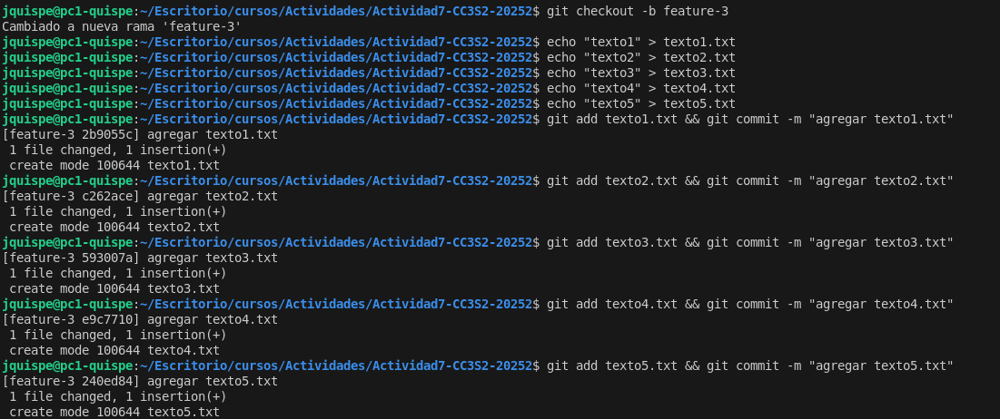
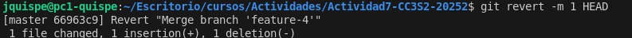
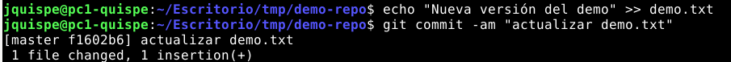
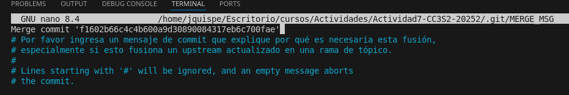

### **Actividad 7: Explorando estrategias de fusión en Git**

**Entrega:** sube **todas** las respuestas y evidencias en la carpeta **`Actividad7-CC3S2/`**.

#### Preámbulo

Aquí va un repaso rápido para que puedas seguir sin problemas esta actividad:

* `git init`: Inicializa un repo en el directorio actual.

  * **Sugerencia:** fija `main` como rama por defecto:

    ```bash
    git config --global init.defaultBranch main
    # o al crear el repo:
    git init -b main
    ```
* `git add <archivo>`: Lleva cambios al área de staging.
* `git commit -m "Mensaje"`: Crea un commit con lo staged.
* `git checkout -b <rama>`: Crea y cambia a una nueva rama.
* `git checkout <rama>`: Cambia a una rama existente.
* `git log`: Muestra el historial (usa `--graph` para ver el DAG).

**Glosario clave**

* **DAG (Directed Acyclic Graph):** representación del historial; los commits son nodos y las fusiones conectan padres.
* **Merge commit:** commit con múltiples padres que integra ramas.
* **Parent / Parent primario (#1):** commit(es) padre(s) del merge; el **primario** es la rama donde estabas al ejecutar `git merge`.
* **Rama (branch):** puntero móvil a un commit.
* **Rebase:** reescribe commits de una rama sobre otra para un historial lineal.
* **PR (Pull Request):** solicitud de fusión en plataformas como GitHub.

**Visualización del DAG**
Puedes usar `gitk --all` (incluido con Git) o la interfaz web de GitHub tras hacer push.

**Nota Windows/WSL (fin de línea y permisos)**
Para evitar "falsos cambios" y problemas de EOL/permisos:

```bash
# Si trabajas en Windows/WSL:
git config core.autocrlf input   # (o true si usas sólo Windows)
git config core.filemode false
```

**Organización sugerida (repos limpios por ejercicio)**
Para que las evidencias no se mezclen, crea un repo **por cada sección** (o limpia entre ejercicios):

```bash
mkdir -p ~/git-fusiones/ej01 && cd ~/git-fusiones/ej01
```

#### Objetivo de aprendizaje

Comprender y aplicar **fast-forward**, **no-fast-forward** y **squash**, reconociendo ventajas/limitaciones e impacto en el historial (trabajo individual, equipos, CI/CD y DevSecOps).
El **apéndice** amplía con variantes y controles de seguridad propios de DevOps/DevSecOps.

#### Prerrequisitos

* Git >= 2.30 instalado y configurado (`git config --global user.name`, `user.email`).
* Rama por defecto: `main`.
* Editor de texto y terminal.

#### Formato de entrega (obligatorio)

Estructura exacta del directorio a entregar:

```
Actividad7-CC3S2/
├─ evidencias/
│  ├─ 01-ff.log
│  ├─ 02-no-ff.log
│  ├─ 03-squash.log
│  ├─ 04-conflicto.log
│  ├─ 05-compare-fastforward.log
│  ├─ 06-compare-noff.log
│  ├─ 07-compare-squash.log
│  ├─ 08-revert-merge.log
│  ├─ 09-ff-only.log
│  ├─ 10-rebase-ff.log
│  ├─ 11-pre-commit-merge.log
│  ├─ 12-octopus.log
│  ├─ 13-subtree.log
│  ├─ 14-x-strategy.log
│  ├─ 15-signed-merge.log
│  └─ capturas/  (opcional: imágenes de PRs o del DAG)
└─ README.md  (respuestas a TODAS las preguntas)
```

> Guarda salidas con redirección, p. ej.:
> `git log --graph --oneline --decorate --all > evidencias/01-ff.log`

#### Contexto y estrategias base

Las fusiones integran trabajo de múltiples ramas. Elegir bien impacta **trazabilidad**, **limpieza del historial** y **auditoría** en CI/CD.

#### Resumen de estrategias

* **Fast-forward (`--ff`)**: mueve el puntero sin crear merge commit. Historial **lineal** y limpio. Ideal en trabajo individual o secuencial.
* **No-fast-forward (`--no-ff`)**: crea **merge commit** con **dos padres** (preserva punto de integración). Útil en colaboración y auditorías.
* **Squash (`--squash`)**: **aplana** varios commits de la feature en **uno** en `main`. Mantiene `main` limpia; **no** crea merge commit ni enlaza la rama en el DAG (se pierde detalle intermedio).

> Buenas prácticas:
>
> * En pipelines estrictos, considerar `git merge --ff-only`.
> * Alternativa: **"Rebase + FF"** (o "Rebase and merge") para linealidad con trazabilidad vía PR.

#### Ejemplos prácticos

#### 1) Fusión **Fast-forward** (`git merge --ff`)

1. Repo nuevo, commit inicial en `main`.
2. `git checkout -b feature-1`, realiza un commit.
3. `git checkout main && git merge feature-1` (FF automático).


4. Evidencia:

   ```bash
   git log --graph --oneline --decorate --all --first-parent > evidencias/01-ff.log
   ```


#### 2) Fusión **No-fast-forward** (`git merge --no-ff`)

1. Repo nuevo, commit inicial en `main`.
2. `git checkout -b add-feature`, realiza 1–2 commits.
3. `git checkout main && git merge --no-ff add-feature`.


ventana de edicion nano para editar mensaje de commit que aparecio tras intentar `git merge --no-ff`:


4. Evidencia:

   ```bash
   git log --graph --oneline --decorate --all > evidencias/02-no-ff.log
   ```


#### 3) Fusión **Squash** (`git merge --squash`)

1. Repo nuevo, commit inicial en `main`.
2. `git checkout -b feature-3`, realiza varios commits.
3. `git checkout main && git merge --squash feature-3`
4. `git add -A && git commit -m "Squash de feature-3: documentación estándar"`




5. Evidencia:

   ```bash
   git log --graph --oneline --decorate --all > evidencias/03-squash.log
   ```


### Ejercicios guiados

#### A) Evitar (o no) `--ff`

* Ejecuta una fusión FF real.

   

* **Pregunta:** ¿Cuándo **evitarías** `--ff` en un equipo y por qué?

   Evitaría usar --ff cuando trabajo en equipo y queremos que quede claro en la historia de Git cuándo una rama fue unida a otra, con --ff parece que todos los cambios fueron hechos directo en develop o main, y se pierde el marco de que esos commits venían de una rama de feature específica, eso puede hacer más difícil seguir el rastro de qué cambios pertenecen a qué tarea.

#### B) Trabajo en equipo con `--no-ff`

* Crea dos ramas con cambios paralelos y **fusiónalas con `--no-ff`**.

   
   

* **Preguntas:** ¿Qué ventajas de trazabilidad aporta? ¿Qué problemas surgen con **exceso** de merges?

   Usar --no-ff en un equipo tiene la ventaja de que la historia queda más clara, cada vez que una rama se une a otra, Git crea un commit de merge que marca ese momento, así se puede ver fácilmente de dónde salió un conjunto de cambios y cuándo se integraron, lo que da más trazabilidad y contexto al revisar el historial y problemas.
   El lado negativo es que si se abusa de los merges, el historial puede llenarse de commits de fusión que no aportan mucho valor, esto lo vuelve más desordenado y cuesta un poco más leer la línea principal del proyecto, por eso conviene usar --no-ff de forma equilibrada, para trabajos importantes y no para cada pequeños ajustes.

#### C) Squash con muchos commits

* Haz 3-4 commits en `feature-3` y aplánalos con `--squash`.

   
   

* **Preguntas:** ¿Cuándo conviene? ¿Qué se **pierde** respecto a merges estándar?

   El squash conviene cuando una rama de feature tiene muchos commits pequeños que no aportan gran cosa al historial. Con --squash se pueden aplanar todos en un solo commit limpio y descriptivo, lo que deja la historia más ordenada y fácil de leer; lo que se pierde frente a un merge estándar es el detalle de cómo se fue construyendo la solución paso a paso, pues ya no queda el registro de cada commit intermedio, solo el resultado final, eso hace más difícil revisar la evolución o deshacer cambios específicos dentro de esa rama.

#### Conflictos reales con **no-fast-forward**

Para **garantizar** conflicto, **ambas ramas deben editar la misma línea**.

1. Repo nuevo -> commit inicial con `index.html`:

   ```html
   <h1>Proyecto CC3S2</h1>
   ```

   

2. `git checkout -b feature-update`
   Cambia **esa misma línea** a:

   ```html
   <h1>Proyecto CC3S2 (feature)</h1>
   ```
   Commit.

   

3. `git checkout main`
   Cambia **la misma línea** a:

   ```html
   <h1>Proyecto CC3S2 (main)</h1>
   ```
   Commit.

   

4. Fusiona:

   ```bash
   git merge --no-ff feature-update
   ```

   **Ver el conflicto:**

   

   ```bash
   git status
   git diff
   ```

   

5. Resuelve eliminando `<<<<<<< ======= >>>>>>>` e integrando coherentemente.

   

6. `git add index.html && git commit` (cierra el merge).

   

   

7. Evidencia:

   ```bash
   git log --graph --oneline --decorate --all > evidencias/04-conflicto.log
   ```

   

**Preguntas**

* ¿Qué pasos adicionales hiciste para resolverlo?

Para resolver el conflicto tuve que abrir el archivo marcado (index.html), buscar las secciones con <<<<<<<, ======= y >>>>>>>, y decidir mantener la version de feature-update, después eliminé esas marcas, dejé el contenido adecuado.

* ¿Qué prácticas (convenciones, PRs pequeñas, tests) lo evitarían?

Para evitar este tipo de problemas en equipo, ayudan buenas prácticas como definir convenciones claras de edición, quién toca qué archivos, hacer PRs pequeñas y frecuentes para integrar cambios rápido, y apoyarse en revisiones de código, ademas ayuda tener tests automáticos que faciliten detectar si al resolver un conflicto rompimos alguna funcionalidad, esto reduce la probabilidad de choques y hace más fácil resolverlos cuando ocurren.

### Comparar historiales tras cada método

Genera y guarda estas vistas (**usa dos guiones `--`**):

* **Fast-forward (first-parent):**

  ```bash
  git log --graph --oneline --decorate --all --first-parent > evidencias/05-compare-fastforward.log
  ```

   

* **Solo merges (destaca no-ff):**

  ```bash
  git log --graph --oneline --merges --decorate > evidencias/06-compare-noff.log
  ```

   

* **Vista completa (útil tras squash):**

  ```bash
  git log --graph --oneline --decorate --all > evidencias/07-compare-squash.log
  ```

   

**Preguntas**

* ¿Cómo se ve el DAG en cada caso?

   Fast-forward (first-parent): la línea principal queda casi recta: commit inicial -> feature-1 -> index.html -> merge de feature-2 -> squash de feature-3. Solo se ve el camino principal, sin desplegar lo que hubo dentro de cada rama.

   Solo merges (no-ff): aparecen solo los puntos de integración, como f902685 Merge branch 'feature-2'. No se muestran los commits internos (agregar texto2–5).

   Vista completa: incluye todo, los commits individuales de feature-3 (textos 2–5), el squash, el merge de feature-2 y hasta la rama feature-1, es la representación más detallada, mostrando tanto la evolución real como las integraciones. En este caso la unica diferencia con el primer DAG es que en esta vista completa es visible la bifurcación en el merge de feature-2.

* ¿Qué método prefieres para: trabajo individual, equipo grande, repos con auditoría estricta?

   Trabajo individual:
   Prefiero fast-forward (first-parent) porque me da un historial limpio, lineal y fácil de leer. No necesito poco de merges, ya que todo lo controlo yo.

   Equipo grande:
   Aquí prefiero no-ff merges visibles porque necesito saber cuándo y cómo se integraron las ramas, esto ayuda a revisar, revertir o auditar qué cambios vinieron de cada feature branch.

   Repos con auditoría estricta (empresas, proyectos críticos):
   Es preferible la vista completa, y además usar merges explícitos y no tanto squash para que quede un historial transparente y trazable, así se puede reconstruir fácilmente qué hizo cada rama y cuándo.

#### Revertir una fusión (solo si **HEAD es un merge commit**)

1. Asegura un **merge commit** reciente (del ejercicio `--no-ff`).

   

2. Verifica que `HEAD` tiene **dos padres**:

   ```bash
   git show -s --format=%P HEAD
   ```

   

3. Revertir manteniendo la base como **mainline / parent primario (#1)**:

   ```bash
   git revert -m 1 HEAD
   ```

   

   

4. Evidencia:

   ```bash
   git log --graph --oneline --decorate --all > evidencias/08-revert-merge.log
   ```

   
   
**Preguntas**

* ¿Cuándo usar `git revert` en vez de `git reset`?

Cuando queremos deshacer cambios sin borrar historial, especialmente en repositorios compartidos. Genera un commit inverso que mantiene la trazabilidad de lo ocurrido, en cambio git reset reescribe la historia.

* ¿Impacto en un repo compartido con historial público?

En un repositorio compartido con historial público, revert es mucho más seguro porque mantiene la línea de tiempo sin cambios y todos ven claramente qué se deshizo, en cambio, un reset forzado obliga a los demás a rehacer sus ramas porque la base cambió.

### Variantes útiles para DevOps/DevSecOps

#### A) Fast-Forward **Only** (merge seguro)

**Objetivo:** evitar merges implícitos; si no es FF, falla.
**Pasos**

1. Crea `feature-ffonly` desde `main`, añade 1 commit.

   

2. En `main`: `git merge --ff-only feature-ffonly` (debe pasar).

   

3. Para forzar un fallo didáctico: crea un commit en `main` tras crear la rama e intenta de nuevo (fallará).

   

4. Evidencia:

   ```bash
   git log --graph --oneline --decorate --all --first-parent > evidencias/09-ff-only.log
   ```

   

#### B) **Rebase + FF** (historial lineal con PRs)

**Objetivo:** linealidad sin merge commit.
**Pasos**

1. `git checkout feature-rebase` (con 2-3 commits), actualiza base:

   ```bash
   git fetch origin && git rebase origin/main
   ```

   
   

2. Integra:

   ```bash
   git checkout main && git merge feature-rebase
   ```

   

3. Evidencia:

   ```bash
   git log --graph --oneline --decorate --all --first-parent > evidencias/10-rebase-ff.log
   ```

   

#### C) Merge con **validación previa** (sin commitear)

**Objetivo:** correr linters/tests/escáneres **antes** de sellar el merge.
**Pasos**

1. `git merge --no-commit --no-ff feature-validate`

   

2. Validaciones reproducibles mínimas (elige según tu proyecto):

   ```bash
   bash -n script.sh              # lint básico de shell
   python -m pyflakes || true     # si hay Python, lint suave
   # o tu pipeline local:
   make test && make lint
   ```

   Basta con bash -n script.sh, debería no mostrar nada si está ok. Si fallan, podemos abortar el merge: `git merge --abort`

3. Si todo ok: `git commit`

   

4. Evidencia:

   ```bash
   git log --graph --oneline --decorate --all > evidencias/11-pre-commit-merge.log
   ```

   

#### D) **Octopus Merge** (varias ramas a la vez)

**Objetivo:** integrar ramas **triviales** sin conflictos.
**Pasos**

1. Prepara `feat-a`, `feat-b` (commits pequeños, sin tocar mismas líneas).

   

2. `git checkout main && git merge feat-a feat-b`

   
   

3. Evidencia:

   ```bash
   git log --graph --oneline --merges --decorate > evidencias/12-octopus.log
   ```

   

#### E) **Subtree** (integrar subproyecto conservando historial)

**Objetivo:** vendorizar/incrustar un repo externo en un subdirectorio.
**Pasos**

1. Opción liviana (recomendado): usa un repo mínimo propio para no descargar mucho:

   ```bash
   git subtree add --prefix=vendor/demo https://github.com/tu-usuario/repo-minimo.git main
   ```

   Preparamos un repositorio externo para el ejercicio:

   

   Agregamos el contenido de demo-repo dentro de vendor/demo/, pero sin perder su historial:

   

2. Sincroniza:

   ```bash
   git subtree pull --prefix=vendor/demo https://github.com/tu-usuario/repo-minimo.git main
   ```

   Simulamos actualización en el repo externo:

   

   Sincronizamos en el repo principal, es decir integramos los cambios del repo externo:

   
   

3. Evidencia:

   ```bash
   git log --graph --oneline --decorate --all > evidencias/13-subtree.log
   ```

   

#### F) Sesgos de resolución y normalización (algoritmo ORT)

**Objetivo:** demostrar opciones del merge resolver.
**Pasos**

* Sólo en conflictos:

  ```bash
  git merge -X ours  feature-x
  git merge -X theirs feature-x
  ```

   Creamos ramas con conflictos:

   

   Probar estrategias:

   - Con “ours” (quedar con lo de la rama actual): `git merge -X ours feature-x`
   - Con “theirs” (aceptar lo de la rama que integramos): `git merge -X theirs feature-x`

      

      En este caso elegi ours porque queria que el merge respete lo que ya está en mi rama actual. Esto me asegura que los cambios que ya han sido validados no se sobrescriban con los de la rama secundaria y asi reducir riesgos de perder trabajo estable.

* Sensibilidad a renombrados:

  ```bash
  git merge -X find-renames=90% feature-rename
  ```
   
   -X find-renames=90%: le dice a Git que sea más estricto al detectar renombrados, así evita confundir un rename con un archivo borrado y otro nuevo.

* EOL mixtos:

  ```bash
  git merge -X renormalize feature-eol
  ```

   -X renormalize: normaliza automáticamente los finales de línea (LF/CRLF) cuando distintas ramas usan configuraciones diferentes, evitando conflictos innecesarios solo por formato.

**Evidencia:**

```bash
git log --graph --oneline --decorate --all > evidencias/14-x-strategy.log
```

   

#### G) **Firmar** merges/commits (auditoría y cumplimiento)

**Objetivo:** trazabilidad criptográfica.
**Pasos**

1. Configura firma (GPG o Sigstore). **Asegúrate de que el email de la firma coincide con `git config user.email`** para que la plataforma valide la firma.

   - Generamos una clave GPG (si no tienes):

      

   - Lista de claves:

      

   - Configuracion Git para usarla:

      

2. Merge firmado:

   ```bash
   git merge --no-ff --gpg-sign feature-signed
   ```

   - Creamos una rama de prueba:

      

   - Vuelta a main e integramos firmando el merge:

      

      Ingresamos el passphrase de la clave GPG, y el commit de merge quedará firmado.

3. Verifica y guarda:

   ```bash
   git log --show-signature -1 > evidencias/15-signed-merge.log
   ```

   